# Lab 07: Implementing Governance and Compliance

## Objective

In that lab we will initially reconnect the migrated SQL Database back
to the Web Tier and test that we are able to access the **Smart Hotel
Application** after it has been migrated to cloud. Then we will optimize
the Cloud environment using **Microsoft Cloud Adoption Framework** for
Azure (**CAF**).

We will also create **Azure Policies** to assign and manage Tags and
list non-compliant resource and utilize Tags for administration.

We will also create tag and check the Resource locks functionality.

## Exercise 1: Connecting the Migrated Database to the Web Tier

As we had performed the Migration of the VMs using Azure Migrate and
Database migration using **Azure Data Studio / Azure Database Migration
Service**. Now we will be connecting the Database back to the Web tier
by modifying the Connection details on the VM **smarthotelweb2**.

### Task 1: Configure the database connection

1.  The application tier machine **smarthotelweb2** is configured to
    connect to the application database running on
    the **smarthotelsql** machine.

2.  On the migrated VM **smarthotelweb2**, this configuration needs to
    be updated to use the Azure SQL Database instead.

3.  On the Lab VM open the Edge browser and navigate to Azure Portal
    Virtual Machine blade
    - `https://portal.azure.com/#view/HubsExtension/BrowseResource/resourceType/Microsoft.Compute%2FVirtualMachines`

4.  From the list of VMs Start the below 2 migrated VMs

    - **Smarthotelweb1**

    - **smarthotelweb2**

    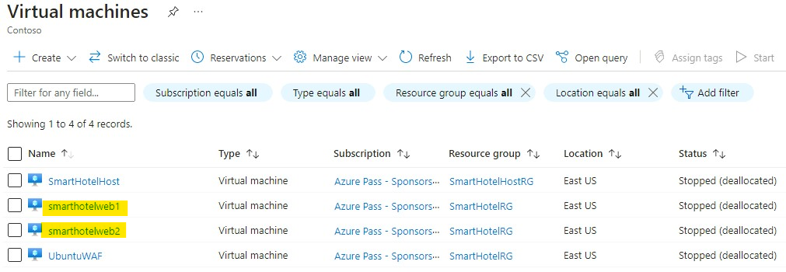

5.  Select the **smarthotelweb2** VM, then from the overview blade,
    select **Connect**.

    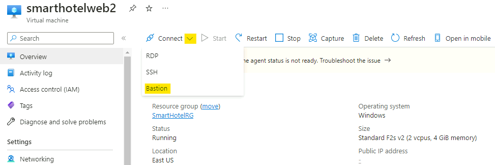

6.  Select **Bastion** and connect to the machine with the
    Username `administrator` and the password `demo!pass123`

    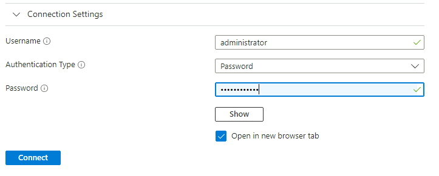

    > **Note** - A popup blocker of your web browser must be disabled in order
    to connect, and when prompted, **Allow** clipboard access.

    

    

7.  In the **smarthotelweb2** remote desktop session, open Windows
    Explorer and navigate to
    the `C:\inetpub\SmartHotel.Registration.Wcf` folder.
    Double-click the **Web.config** file and open with Notepad.

    

8.  Update the **DefaultConnection** setting to connect to your Azure
    SQL Database.

    

9.  You can find the connection string for the Azure SQL Database in the
    Azure portal by browsing to the database and selecting **Show
    database connection strings**.

    

10. Copy the **ADO.NET** connection string,

    

11. Paste the copied string by adding the
    password `demo!pass123` into the web.config file
    on **smarthotelweb2**, replacing the existing connection string. 

    

    **Note:** **Be careful not to overwrite the 'providerName' parameter
    which is specified after the connection string.**

    

    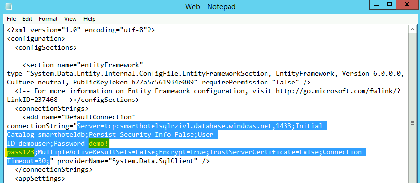

    > **Note:** You may need to open the clipboard panel on the left-hand edge
    of the Bastion window, paste the connection string there, and then paste
    into the VM.

12. **Save** the **web.config** file and exit your Bastion remote
    desktop session.

### Task 2: Configure the public IP address and test the SmartHotel application

In this task, you will associate an Application Gateway with Web
Application Firewall (WAF) to replace the Ubuntu VM with the Azure
managed service.

1.  Navigate to the **SmartHotel-WAF** Application Gateway in
    the **SmartHotelRG** resource group.

    

2.  Select **Backend pools** under the Settings section, and select
    the **WebBackend** pool

    

3.  Set the Target type to **Virtual machine** and the Target to the NIC
    of **smarthotelweb1**; select **Save** to update the backend pool

    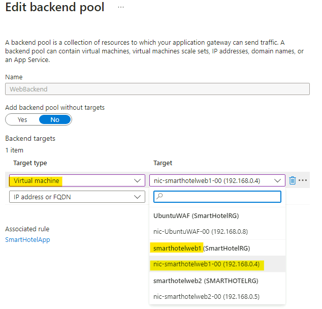

    > **Note:** This backend pool is already associated with the front-end IP
    address of the Application Gateway via the SmartHotelApp rule. The
    front-end IP, listener, rule, and backend pool were all created with the
    Application Gateway. This step now ties the migrated VM to the front
    end.

4.  Navigate to the **Overview** of the Application Gateway and note the
    IP address associated with the public IP address

    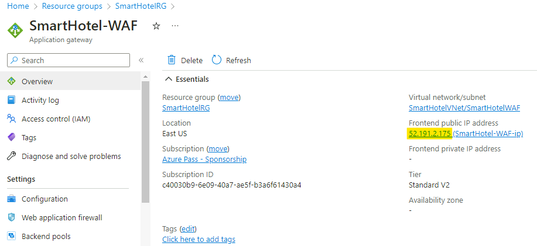

5.  Open a new browser tab and paste the IP address into the address
    bar. Verify that the SmartHotel360 application is now available in
    Azure.

    

    > **Note:** At this point the base Application Gateway service is
    providing access to the backend application. This validates that the
    application is working and can be further protected by the WAF in the
    following steps.

6.  Hence, we have successfully migrated the application from
    on-premises to cloud and able to make the **Smart Hotel
    Application** live once the infrastructure has been migrated to
    Azure.

    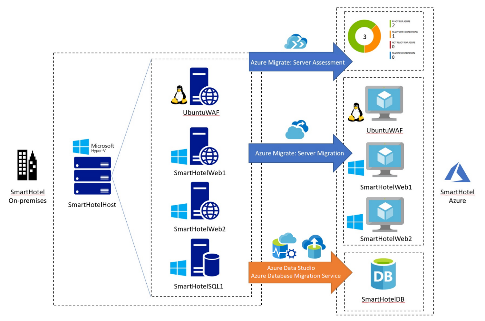

## Exercise 2: Implementing governance with CAF Azure Foundation Blueprint

The **Microsoft Cloud Adoption Framework for Azure (CAF)** Foundation
blueprint deploys a set of core infrastructure resources and policy
controls required for your first production grade Azure application.
This foundation blueprint is based on the recommended pattern found in
CAF.

The CAF Foundation blueprint sample deploys recommended infrastructure
resources in Azure that can be used by organizations to put in place the
foundation controls necessary to manage their cloud estate. This sample
will deploy and enforce resources, policies, and templates that will
allow an organization to confidently get started with Azure.

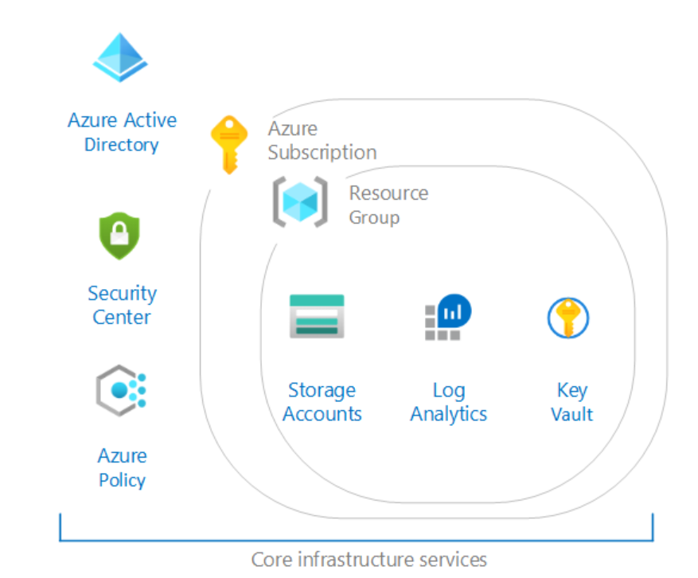

To deploy the Microsoft Cloud Adoption Framework for Azure (CAF)
Foundation blueprint sample, the following steps must be taken:

- Create a new blueprint from the sample

- Mark your copy of the sample as Published

- Assign your copy of the blueprint to an existing subscription.

### Task 1: Create blueprint from sample

First, implement the blueprint sample by creating a new blueprint in
your environment using the sample as a starter.

1.  Select **All services** in the left pane. Search for and
    select **Blueprints**.

    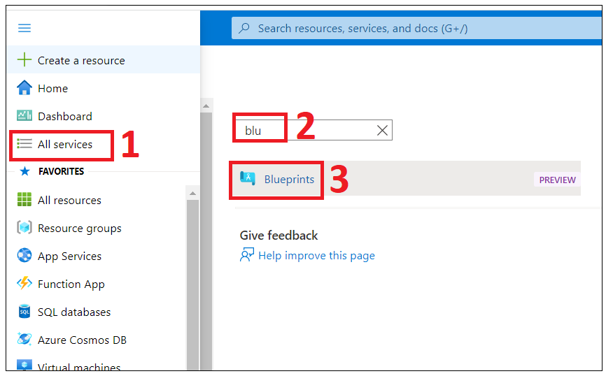

2.  From the Getting started page on the left, select
    the **Create** button under **Create a blueprint**.

    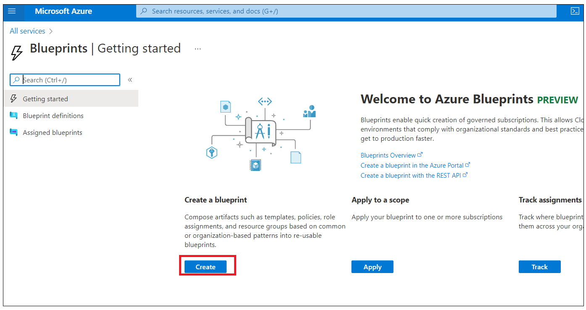

3.  Find the **CAF Foundation blueprint** sample under **Other
    Samples** and select **Use this sample**.

    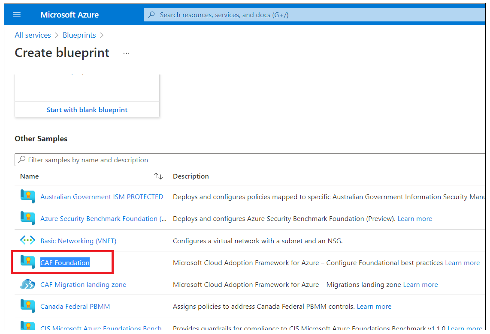

4.  Enter the Basics of the blueprint sample:

    - Blueprint name: `CAFblueprint1`

    - Definition location: Use the ellipsis and select
      the **Subscription**.

    - Select **Next:** **Artifacts**

    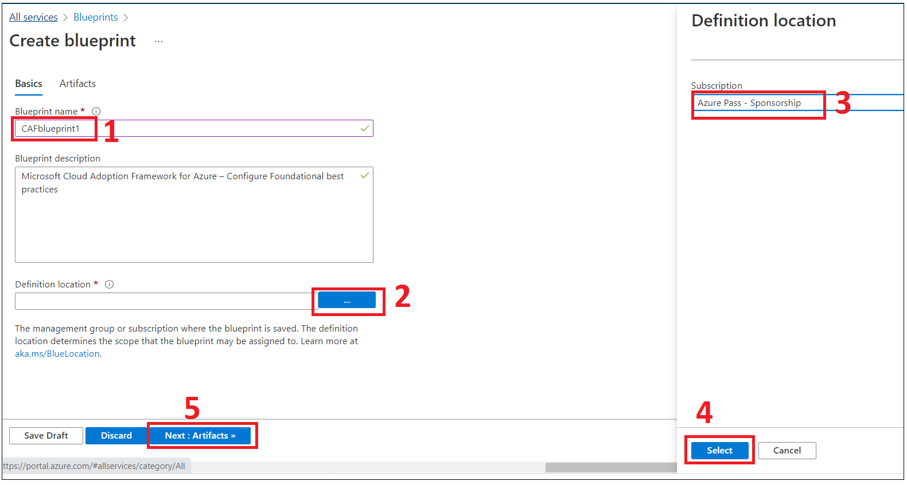

5.  Review the list of artifacts that make up the blueprint sample. Many
    of the artifacts have parameters that we'll define later.

6.  Click on **Append CostCenter TAG to Resource Groups**

    - Tag Name – `CostCenterBootCamp`

    - Uncheck “**This value should be specified when the blueprint is
      assigned**” for Tag Value

    - Tag Value – `Azure Architect “Month”` - substitute month with
      the current month. Eg. **September**

    - Click on **Save**

    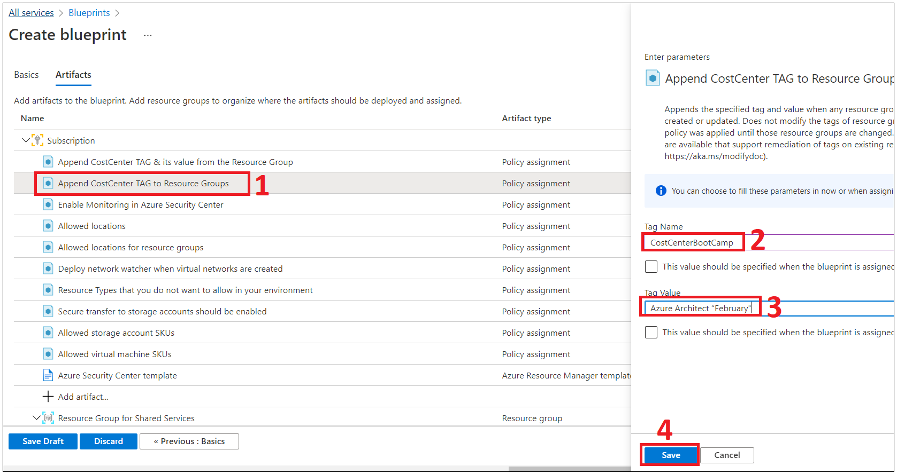

7.  Click on **Append CostCenter TAG & its value from the Resource
    Group**

    - Tag Name – `CostCenterBootCamp`

    - Click on **Save**.

    - Select **Save Draft** when you've finished reviewing the blueprint
      sample.

    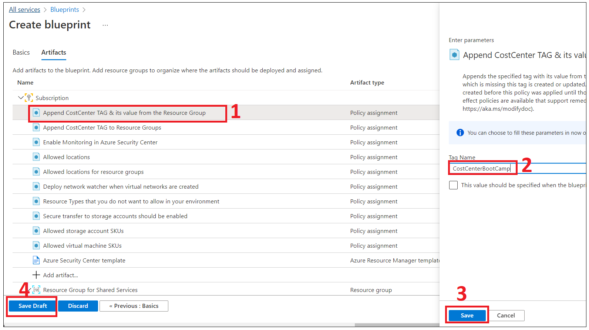

    

8.  Now close the **Create a blueprint** blade, it will go back
    to **Getting started page**.

You have completed this task. Do not close the tab and proceed ahead
with the next task.

### Task 2: Publish the sample copy

The blueprint sample has now been created in your environment. It's
created in Draft mode and must be Published before it can be assigned
and deployed.

1.  Click on **Blueprint definitions**, the Sample Blueprint we have
    created is listed as **CAFblueprint1** click on it to show the
    details.

    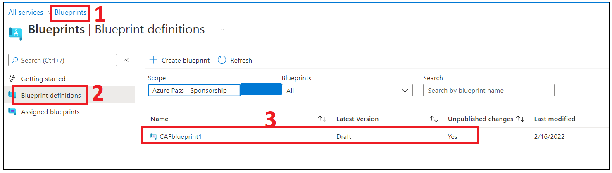

2.  On the details page, click on **Publish blueprint**.

    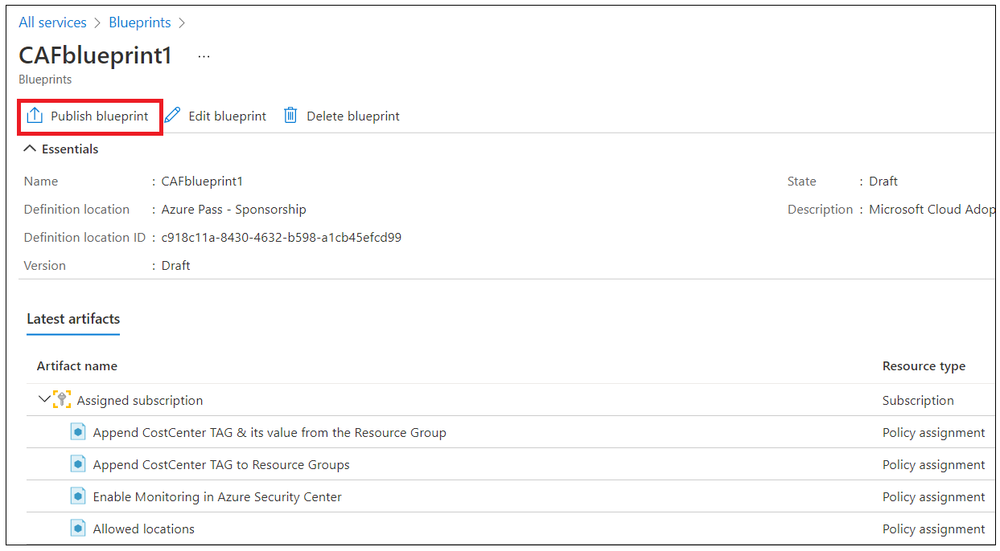

3.  On the Publish blueprint, provide below details and click
    on **Publish**.

    - Version - `CAFblueprintVer.1.0`

    - Change notes - `CAFblueprint Version 1.0`

    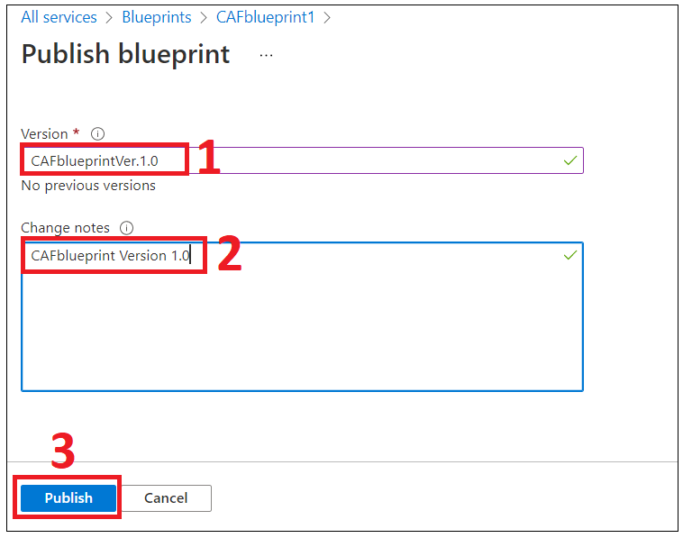

### Task 3: Assign the sample copy

Once the copy of the blueprint sample has been successfully Published,
it can be assigned to a subscription within the management group it was
saved to. This step is where parameters are provided to make each
deployment of the copy of the blueprint sample unique.

1.  While still on the **CAFblueprint1** page, click on **Assign
    blueprint**.

    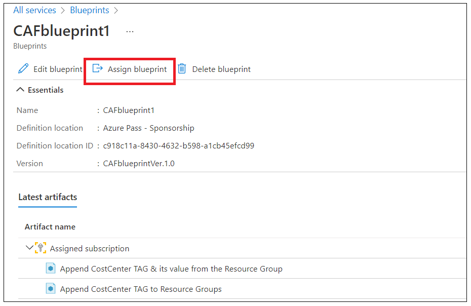

2.  On the Assign blueprint page, provide the below details.

    - Assignment Name: `Assignment-CAFblueprint1-WestUS`

    - Location – **West US**

    - Blueprint definition version - **CAFblueprintVer.1.0**

    - Lock Assignment – **Do Not Delete**

    

    - Managed Identity – **System Assigned**

    - Which Azure Regions will allow resource to be built in – **West US**

    - Enter your organization name
    – `BCXXXXXX` substitute **XXXXXX** with random number.

    - Select the Azure Region to deploy Resources – **West US**

    

    - Under **Artifacts parameters** provide the below only.

    - Storage Account SKUs you want to ALLOW- **Standard_LRS**

    - Virtual Machine SKUs you want to ALLOW – **Standard_D2_v3**

    

    - Select the Azure Resource Types that you will DENY – type **sql** and
    then select all resources listed under **Microsoft.Synapse**

        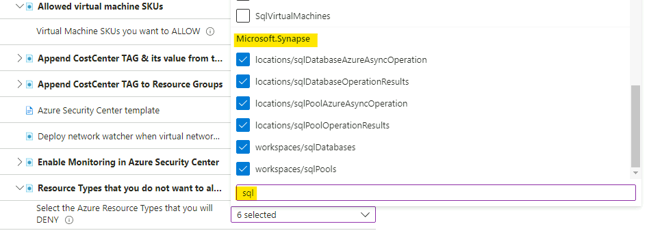

    - Azure AD Group or User **'ObjectID'** to grant permissions in Key
    Vault – **Object ID of the Global Administrator (MOD Administrator)**

    - Follow the link in a new tab and sign with your account details.

    `https://portal.azure.com/#blade/Microsoft_AAD_IAM/UsersManagementMenuBlade/MsGraphUsers`

    

    - Number of days data will be retained in Log Analytics – **365**

    - Azure Region used when establishing the Log Analytics workspace
    – **West US**

    

3.  Once all parameters have been entered, select **Assign** at the
    bottom of the page.

    > **Note** - The blueprint assignment is created, and artifact deployment
    begins. *Deployment takes 20-25 minutes*.

4.  To check on the status of deployment, click on the above
    notification or open the blueprint assignment.

    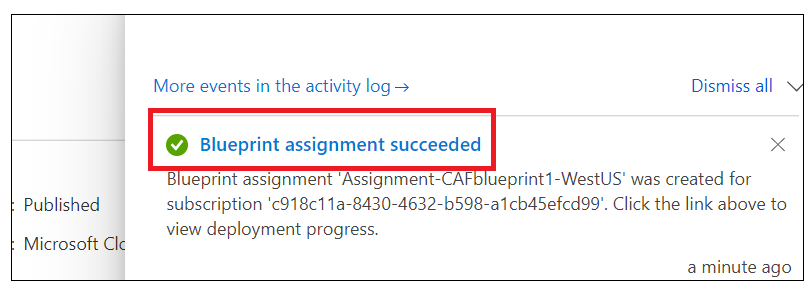

    

5.  You can click on **Refresh**, check if the provisioning state has
    changed to **Succeeded**, then click on the **Assignment.**

    

You have completed this task. Do not close the portal and proceed ahead
with the next task.

### Task 4: Test the Azure Blueprint

1.  Now we can try to **create a Storage account** in a new resource
    group in **East US**.

2.  Click on **+ Create a resource**, then click on **Create** under
    the **Storage account.**

    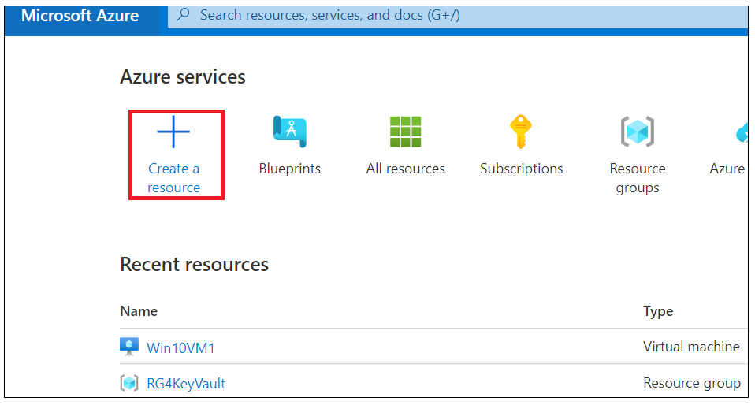

    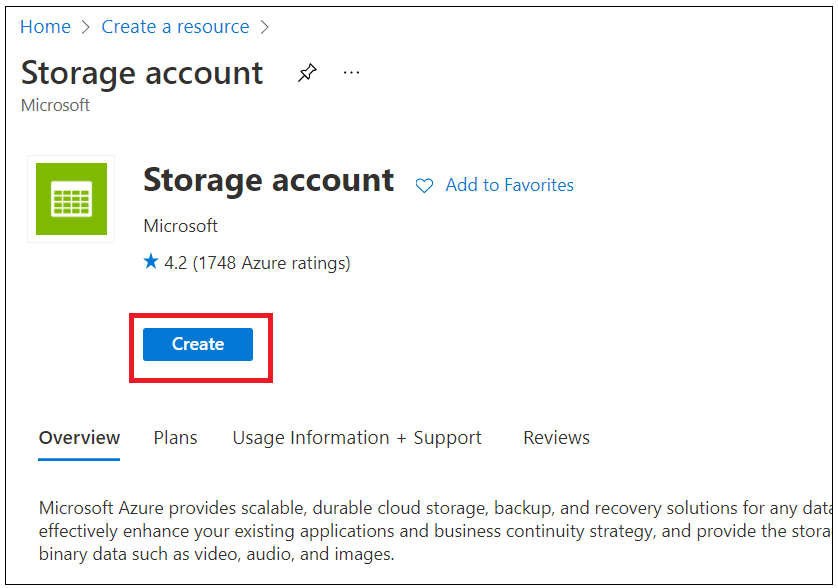

3.  In the Create storage account blade, on the Basics tab, use the
    following values:

    - Subscription: Select your **Azure subscription**.

    - Resource group: **Create new** – **RG4StrorageTest**

    - Storage account name: `teststorageXXXXXX` \[XXXXXXunique
      number\]

    - Region: **East US**

    - Performance: **Standard**

    - Replication: **Locally-redundant storage (LRS)**

    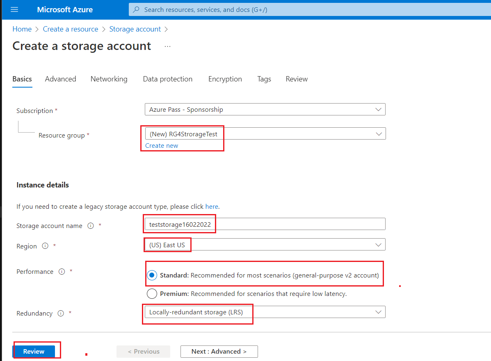

4.  Click on **Review** button, the **Validation** should fail with
    error **Request Disallowed By Policy**. Since we have the Blueprint
    that is applied at Subscription level, now we cannot create any
    resource in location other than **West US**.

    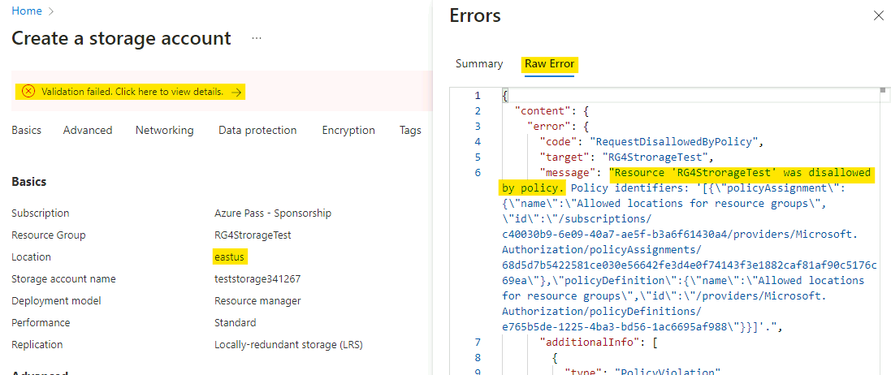

5.  So, we need to change the Location to **West US.**

    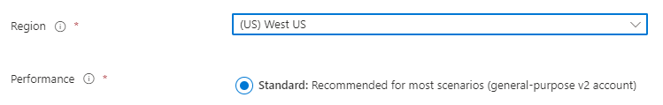

6.  Let’s proceed ahead with the creation to see, how the **Tags** are
    applied \[we had also specified the Tags in the Blueprint\].

7.  Click on **Review** and after validation, click on **Create**.

    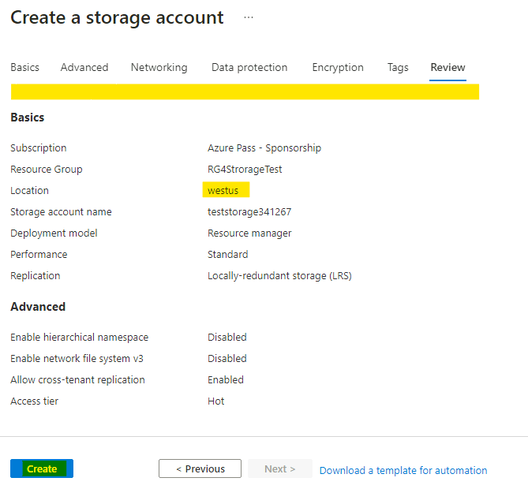

8.  Once the deployment is completed, click on **Go to resource**.

    

9.  On the Storage account **Overview** page, we can see the Tags are
    applied as per the Blueprint, additionally you can click
    on **Tags** and check.

    

    

10. Now we have verified the Blueprint artifacts are in-place and
    working, let just see if we can create a VM with Size other
    than **D2S_v3**.

11. Click on **+ Create a resource**, then click
    on **Create** under **Windows Server 2019** **Datacenter**

    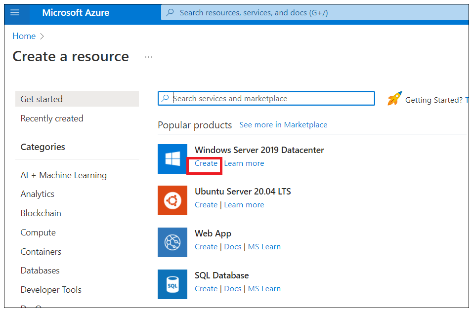

12. On the Basics tab provide the below details,

    - Subscription – choose the appropriate Subscription

    - Resource group – create new - `RG4VMTest`

    - Virtual machine name – `TestVM1`

    - Region – **West US**

    - Availability options – **No infrastructure redundancy required**

    - Image – **Windows Server 2019 Datacenter – Gen2**

    - Size – **E2s_v3** ( you can choose any size other than DS2_v3)

    - Username – `demouser`

    - Password – `demo!pass123`

    - Confirm password - `demo!pass123`

13. Click on **Review + create** and ***wait for validation to fail***

    

14. As expected, the validation should fail due to **VM SKU not
    allowed** as per the Blueprint.

    

15. So, we have tested the *CAF Foundation Blueprint functionality* and
    we have confirmed that the Artifacts parameters that have been setup
    in it are effective to Govern and control deployment.

16. The CAF Foundation lays out a foundational architecture for
    workloads.

You have completed this task. Do not lose the tab and proceed ahead with
the next task.

### Task 5: Remove the Assigned Blueprint and its Policies

Since we have tested the CAF Blueprint, we will clean up to ensure that
it does not prevent us from creating resources which may be restricted
in the Blueprint policies.

1.  In a new tab open the link
    - `https://portal.azure.com/#view/Microsoft_Azure_Policy/BlueprintsMenuBlade/~/BlueprintAssignments`

2.  List the selected assignment and then click on the ellipsis and
    choose **Unassign blueprint**

    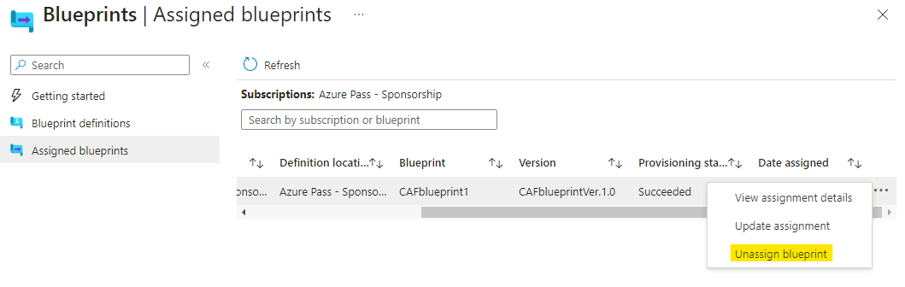

3.  Click on **OK** to confirm

    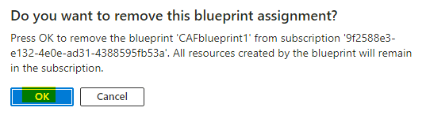

4.  Click on the **Blueprint definitions**, then click on the ellipsis
    and select **Delete blueprint**

    

5.  Click on **Yes** to confirm

    

6.  Click on the link to
    open **Policies** - `https://portal.azure.com/#view/Microsoft_Azure_Policy/PolicyMenuBlade/~/Overview`

7.  Click on Assignments, then review the listed assignment

    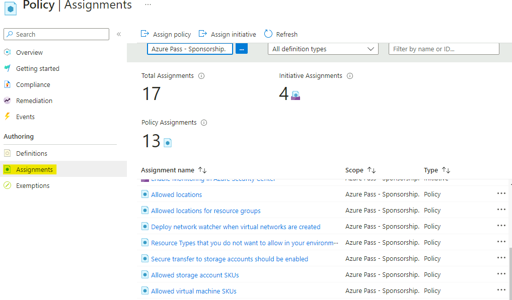

8.  Click on **Allowed locations**, then select **Delete**

    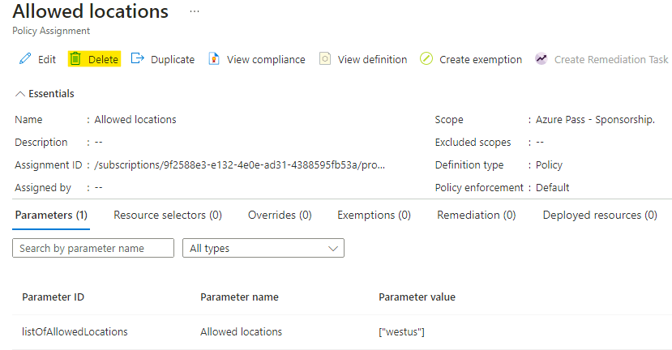

9.  Click on **OK** to confirm

    

10. Similarly delete the remaining assignment listed below

    - **Allowed locations for resource groups**

    - **Allowed storage account SKUs**

    - **Allowed virtual machine SKUs**

    - **Resource Types that you do not want to allow in your
      environment**

## Exercise 3 – Create a policy assignment to identify non-compliant resources.

The first step in understanding compliance in Azure is to identify the
status of your resources. This quickstart steps you through the process
of creating a policy assignment to identify virtual machines that aren't
using managed disks.

At the end of this process, you'll successfully identify virtual
machines that aren't using managed disks. They're *non-compliant* with
the policy assignment.

### Task 1: Create a policy assignment

In this task, you create a policy assignment and assign the *Audit VMs
that do not use managed disks* policy definition.

1.  Launch the **Azure Policy** service in the Azure portal by
    selecting **All services**, then searching for and
    selecting **Policy**.

    

2.  Select **Assignments** on the left side of the
    Azure **Policy** page. An assignment is a policy that has been
    assigned to take place within a specific scope.

    

3.  Select **Assign Policy** from the top of the **Policy -
    Assignments** page.

    

4.  On the **Assign Policy** page, set the **Scope** by selecting the
    ellipsis and then selecting either a **management group or
    subscription**. Optionally, select a **resource group**. A scope
    determines what resources or grouping of resources the policy
    assignment gets enforced on. Then use the **Select** button at the
    bottom of the **Scope** page.

    > **Note:** This example uses the **Azure pass** subscription. Your
    subscription will differ.

5.  Resources can be excluded based on
    the **Scope**. **Exclusions** start at one level lower than the
    level of the **Scope**. **Exclusions** are optional, so leave it
    blank for now.

6.  Select the **Policy definition** ellipsis to open the list of
    available definitions. Azure Policy comes with built-in policy
    definitions you can use. Many are available, such as:

    - Enforce tag and its value

    - Apply tag and its value

    - Inherit a tag from the resource group if missing

7.  Search through the policy definitions list to find the **Audit VMs
    that do not use managed disks** definition. Select that policy and
    then use the **Add** button.

    

8.  The **Assignment name** is automatically populated with the policy
    name you selected, but you can change it. For this example,
    leave *Audit VMs that do not use managed disks*. You can also add an
    optional **Description**. The description provides details about
    this policy assignment. **Assigned by** will automatically fill
    based on who is logged in. This field is optional, so custom values
    can be entered.

    

9.  On the **Advanced** tab, click **Next**. If the policy definition
    selected on the **Basics** tab included parameters, they are
    configured on this tab. Since the *Audit VMs that do not use managed
    disks* has **no parameters**, select **Next** at the bottom of the
    page or the **Remediation** tab at the top of the page to move to
    the next segment of the assignment wizard.

    

    

10. Leave **Create a Managed Identity** unchecked. This box *must* be
    checked when the policy or initiative includes a policy with either
    the **deployIfNotExists** or **modify** effect. As the policy used
    for this quickstart doesn't, leave it blank.

    > Note: For more information, see managed identities
    `https://docs.microsoft.com/en-us/azure/active-directory/managed-identities-azure-resources/overview`
    and how remediation security works
    `https://docs.microsoft.com/en-us/azure/governance/policy/how-to/remediate-resources#how-remediation-security-works`.

    

11. Select **Next** at the bottom of the page or the **Non-compliance
    messages** tab at the top of the page to move to the next segment of
    the assignment wizard.

12. Set the **Non-compliance message** to **Virtual machines should use
    a managed disk.** This custom message is displayed when a resource
    is denied or for non-compliant resources during regular evaluation.

    

13. Select **Next** at the bottom of the page or the **Review +
    Create** tab at the top of the page to move to the next segment of
    the assignment wizard.

14. Review the selected options, then select **Create** at the bottom of
    the page.

    

You have completed this task, please proceed ahead with the next task.

You're now ready to identify non-compliant resources to understand the
compliance state of your environment.

### Task 2: Identify non-compliant resources

1.  Select **Compliance** in the left side of the page. Then locate
    the ***Audit VMs** that do not use managed disks* policy assignment
    you created.

    

If there are any existing resources that aren't compliant with this new
assignment, they appear under **Non-compliant resources**.

### Task 3: Clean up resources

To remove the assignment created, follow these steps:

1.  Select **Compliance** (or **Assignments**) in the left side of the
    Azure Policy page and locate the *Audit VMs that do not use managed
    disks* policy assignment you created.

2.  Right-click the ***Audit VMs** that do not use managed disks* policy
    assignment and select **Delete assignment**.

    

    

You have completed this exercise. Please proceed ahead with the next
exercise.

## Exercise 4 - Tagging Azure Resources with Tags for Administration.

1.  On the Azure Portal in the search bar type **storage** and
    select **Storage account**, when the resource is listed,
    select **strgXXXXXX** Storage account created earlier.

    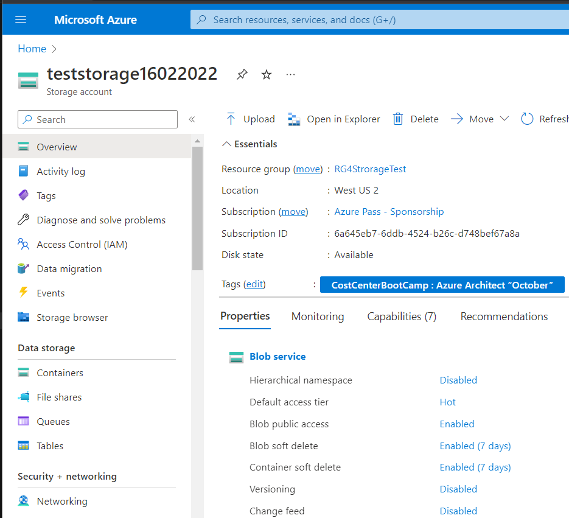

2.  Click on **Tags**, currently there are no tags.

    - Select the **Name field** and enter `CostCenter1`

    - Select the **Value field** and enter `SalesStorage`,

    - Then click on **Apply.**

    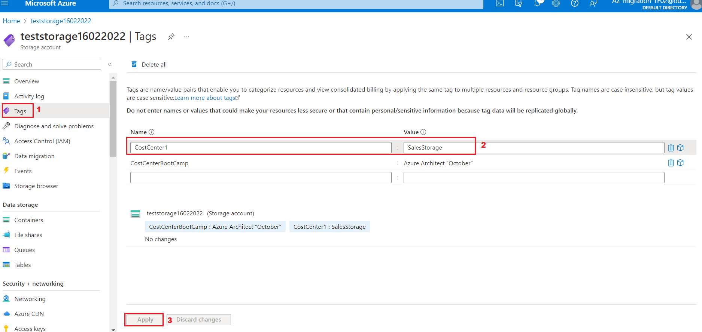

3.  **Tags** have been applied to this Storage account.

    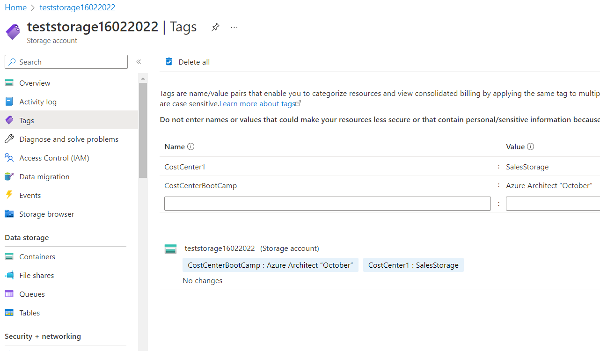

4.  Similarly, we can add the same Tags to resources belonging to the
    same Team, Group, Department, Geographical location etc. We can add
    multiple Tags to same resource as well.

5.  Tags can also be applied from **All resources** as well
    as **Resource group** page, by selecting the resources and then
    clicking on **Assign tags**.

    

6.  On the Azure Portal, click on **Resources groups**, click on Add
    filter, then under filter select the Tags we had
    created `CostCenter1`, then click on **Apply**.

    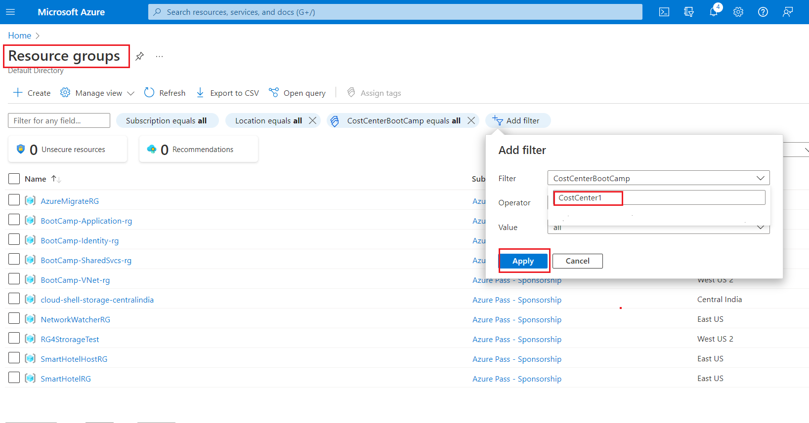

7.  As we only have 1 resource with that Tags it will only be listed
    now.

    

8.  Tags can also be applied automatically
    using **Policies** and **Blueprints**.

You have completed this exercise. Please proceed ahead with the next
Exercise.

## Exercise 5: Protecting Azure Resources with Resource Manager Locks

**Resource Manager Locks** provide a way for administrators to lock down
Azure resources to *prevent deletion or changing of a resource*. These
locks sit outside of the Role Based Access Controls (RBAC) hierarchy and
when applied *will place the restriction on the resource for all users*.
These are very useful when you have an important resource in your
subscription which users should not be able to delete or change and can
help prevent accidental and malicious changes or deletion.

There are two types of resource locks that can be applied:

- **Delete** - This prevents anyone from deleting a resource whilst the
  lock is in place, however they may make changes to it.

- **ReadOnly** - As the name suggests, it makes the resource read only,
  so no changes can be made, and it cannot be deleted. Resource locks
  can be applied to subscriptions, resource groups or individual
  resources as required. When you lock Subscription, all resources in
  that subscription (including ones added later) inherit the same
  lock. *Once applied, these locks impact all users regardless of their
  roles*. If it becomes necessary to delete or change a resource with a
  lock in place, then the lock will need to be removed before this can
  occur.

The best way to ensure that locks are in place and protecting your
resources is to create them at run time and configure them in your ARM
templates. Locks are top level ARM resources; they do not sit underneath
the resource being locked. They refer to the resource being locked, so
this must exist first.

1.  Open the **Cloud Shell** and then click on PowerShell

    

2.  If prompted as “**You have no storage mounted**”, then click on
    Create storage

    

3.  Wait for the **creation to complete**, then on
    the **PowerShell** run the following **commands** to create
    a **Resource Group** and **Storage Account**.

    `New-AzResourceGroup -Name LockRG -Location WestUS`

    

    `New-AzStorageAccount -ResourceGroupName LockRG -Name storageXXXXXX -Location EastUS -SkuName Standard_LRS -Kind StorageV2`

    (Substitute **XXXXXX** in the command random number)

    

4.  Locate the Storage Account and select it. In the search bar type
    storage, when the resource is listed, select **storageXXXX**.

    

5.  On the storage account Overview page, scroll down and
    selects **Locks** under settings. Click on **+ Add** to add a
    resource Lock and On the Add lock provide the below details

    - Lock name – **CriticalStorage**

    - Lock type - **Delete**

    - Notes - **Preventing deletion of this critical storage account**

    - Click on **OK** to add the lock.

    

6.  We have successfully added the resource lock to protect it from
    deletion, let us now try to delete this storage account.

    

7.  Scroll up and select **Overview**, then select **Delete**

    

8.  Since the resource is protected by resource lock it cannot be
    deleted.

    

9.  Similarly, we can create **Read-only Lock** to prevent any changes
    to a resource and protected it from being deleted. E.g. A Critical
    Virtual Network \[Vnet\] or Key Vault.

**Summary**

We should have been able to successfully connect the migrated SQL
Database back to the Web Tier and should have been able to
access **Smart Hotel Application** using the Public IP of the
Application Gateway.

We should have successfully implemented the **Microsoft Cloud Adoption
Framework** Blueprint and have restricted the resource creation to West
US and also be able to only allow a certain SKU of VM as specified.

We should have successfully tested the **Azure Policies** and their
functionality.

We should have successfully tested how the Resource locks function.
