# Lab 01 - Deploying the on-premises environment and landing zone

## Objective

In the Lab we would be deploying the **on-premises environment** and
landing zone using an ARM template which will deploy resources including
the below

- An Azure VM running nested Hyper-V, with 4 nested VMs

- **2** Resources groups with a total of **17** resource which would be
  required in the upcoming exercises.

- A **SmartHotel application**, which is running on nested VMs within
  Hyper-V on the SmartHotelHost

- VNet Peering required post migration.

- Azure SQL database etc.

    

### Task 1: Redeem Azure pass

1.  Open the browser on your lab VM and navigate
    to `www.microsoftazurepass.com`.

2.  Click on **Start**.

    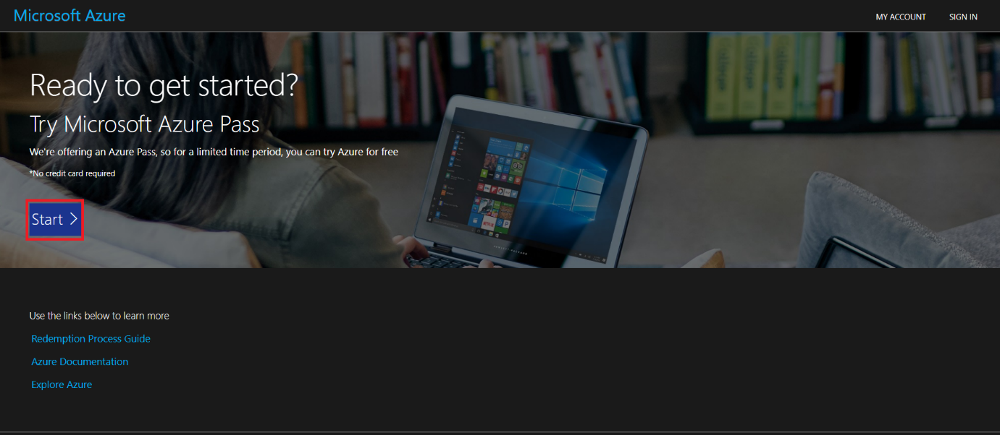

3.  **Sign-in** with your Office365 tenant credentials provided
    in **Resources tab**.

    

    > **Note –** **Please do not redeem the Azure Pass with your personal or
    company credentials as additional Azure Pass would not be provided**

4.  Check that you have logged in with your **365 office
    credentials** and then click on **Confirm** **Microsoft Account
    button**.

    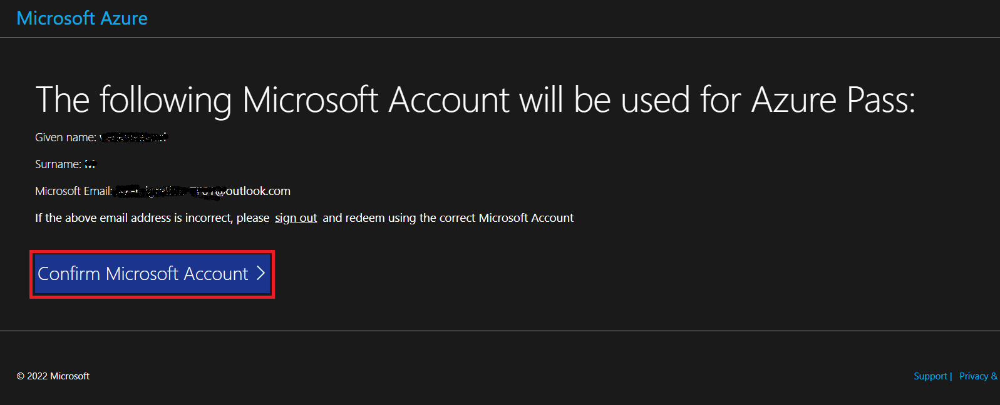

5.  Enter your Promo Code then click **Claim Promo Code.**

    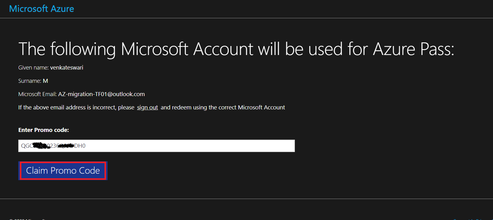

6.  It may take few seconds to process the redemption.

    

7.  Enter correct details in **Your Profile** page.

8.  Select the check box - I agree to the subscription agreement, offer
    details, and privacy statement, and then click on Sign-up button.

    > **Note**: Make sure to give correct details. Incorrect details leads to
    account deactivation.

    

9.  On the Protect your account prompt, click on the Next button

    

10. Click on the **Next** button on the **More information
    required** prompt.

    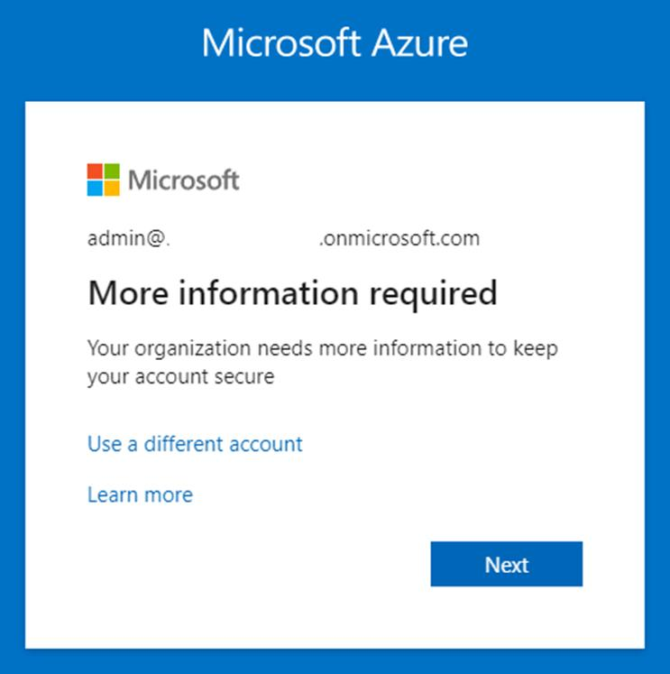

11. Provide the credentials and then complete the MFA sign in.

    

    

12. Once the authentication is completed you will be redirected to the
    Azure Pass redemption page.

13. Wait for the account setup to complete and then click
    on **submit** button.

    

14. You have successfully redeemed and will be redirected to Azure
    portal.

15. You can check your subscription under **Subscription** section.

    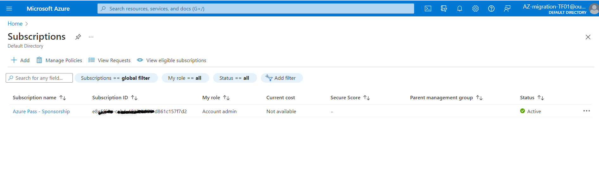

You have completed this task. Do not close the browser and proceed ahead
with the next task.

### Task 2: Increase the vCPU cores required for Deployment

For the Labs we would be using multiple compute resources which would
require additional vCores, so we need to create a request under the
Subscriptions to make sure the lab is executed properly. Subscription
must have sufficient unused quota to deploy the VMs used in this lab.

1.  Login to the Azure Portal `https://Portal.Azure.com` and in the
    Search bar type `Subscriptions`, then select
    the **Subscriptions.**

    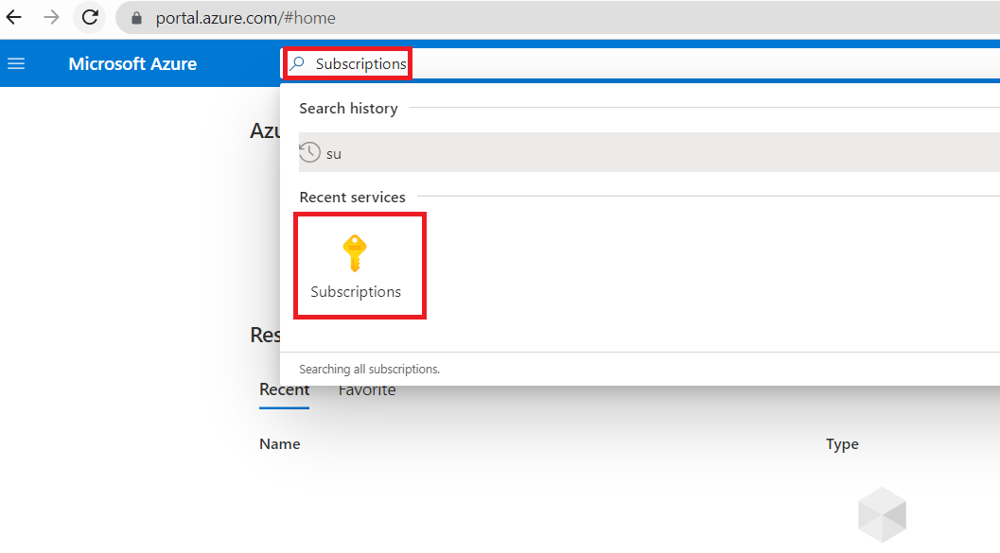

2.  Click on **Azure Pass – Sponsorship** subscription.

    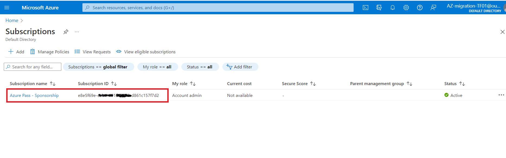

3.  From the list scroll down and select **Resource
    providers** under **Settings**.

    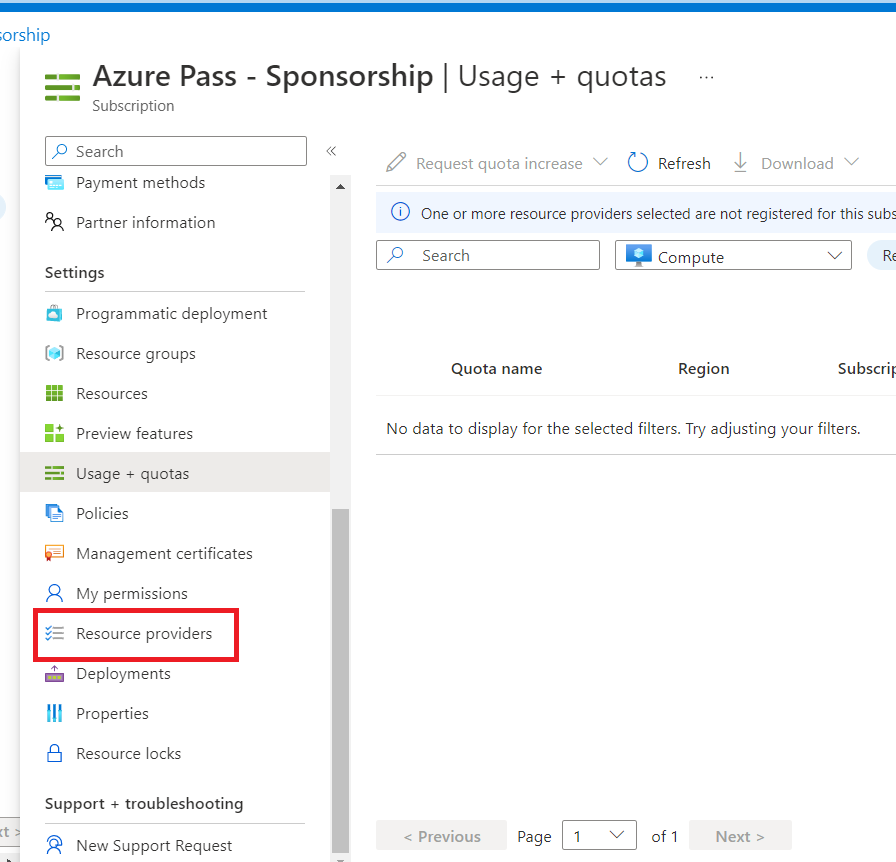

4.  In the Search bar type `Quota` ,click on **Microsoft.Quota** and
    then click on **Register**.

    

5.  Wait for the provider to register.

    

6.  In the Search bar type `Microsoft.Compute`,
    select **Microsoft.Compute** and click on the **Register** button.

7.  You should get a notification as shown in below image.

    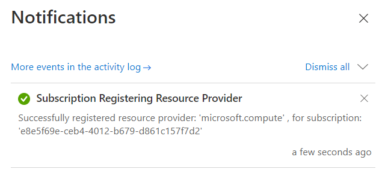

8.  From the list choose Usage + compute, then from
    the **Provider** dropdown select **Compute**, select **West US** as
    Region.

    

9.  From the **Quota name** list, select the checkbox for **Total
    Regional vCPUs**

    

10. Click on **New quota request** and select **Enter a new limit**.

    

11. On the **New quota request** pane, enter 25 for **Total Regional
    vCPUs**, then select **Submit**.

    

    > **Note –** you may be prompted complete the MFA

12. Once you Quota has be approved you should be getting the
    notification as shown below.

    

Your request will be reviewed, and you'll be notified if the request can
be fulfilled. This usually happens within a few minutes. If your request
is not fulfilled, you'll see a link where you can open a support request
so that a support engineer can assist you with the increase.

> **Note:** If your request to increase your VM-family quota is approved,
Azure will automatically increase the regional vCPU quota for the region
where your VM is deployed.

> **Note:** At times you may see a message that a selected quota isn’t
available for an increase. To see which quotas are not available, look
for the Information icon next to the quota name.

You have completed this task. Do not close browser and proceed ahead
with the next task.

### Task 3: Deploy the on-premises environment and landing zone

Check out the json template **EnvironmentDeployment.json** placed in
the **C:\Labfiles** folder of your Lab VM.

This template deploys two Resource groups.

In **SmartHotelHostRG**, a virtual machine running nested Hyper-V, with
4 nested VMs is created. This represents the 'on-premises' environment
which you will assess and migrate during this lab.

The **SmartHotel** application comprises 4 VMs hosted in Hyper-V:

- **Database tier** Hosted on the smarthotelSQL1 VM, which is running
  Windows Server 2016 and SQL Server 2017.

- **Application tier** Hosted on the smarthotelweb2 VM, which is running
  Windows Server 2012R2.

- **Web tier** Hosted on the smarthotelweb1 VM, which is running Windows
  Server 2012R2.

- **Web proxy** Hosted on the UbuntuWAF VM, which is running Nginx on
  Ubuntu 18.04 LTS.

For simplicity, there is no redundancy in any of the tiers.

The other resource group named SmartHotelRG comprises of

To assess the Hyper-V environment, you will use **Azure Migrate: Server
Assessment**. This includes deploying the **Azure Migrate appliance** on
the Hyper-V host to gather information about the environment. For deeper
analysis, the **Microsoft Monitoring Agent** and **Dependency
Agent** will be installed on the VMs, enabling the **Azure Migrate
dependency visualization**.

The **SQL Server database** will be assessed by installing
the **Microsoft Data Migration Assistant (DMA)** on the Hyper-V host,
and using it to gather information about the database. **Schema
migration** and **data migration** will then be completed using
the **Azure Database Migration Service (DMS)**.

**The application, web, and web proxy tiers** will be migrated
to **Azure VMs** using **Azure Migrate: Server Migration**. You will
walk through the steps of building the Azure environment, replicating
data to Azure, customizing VM settings, and performing a failover to
migrate the application to Azure.

**Note:** After migration, the application could be modernized to
use **Azure Application Gateway** instead of the **Ubuntu Nginx VM**,
and to use **Azure App Service** to host both the **web
tier** and **application tiers**. These optimizations are out of scope
of this lab, which is focused only on a 'lift and shift' migration to
Azure VMs.

1.  Go to `C:\LabFiles` on your Lab VM. Look
    for **EnvironmentDeployment.json**. Open the file with **Notepad**,
    and copy the contents.

2.  On the Azure Portal `https://portal.azure.com` search
    for Deploy a custom template and select the same.

3.  Click on **Build your own template in the editor**.

    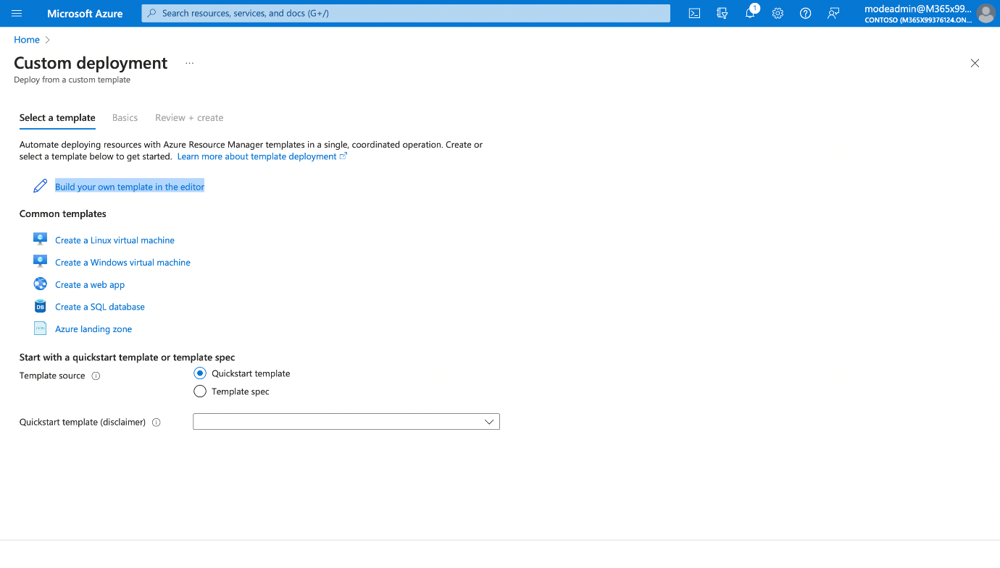

4.  Paste the content that we copied
    from **EnvironmentDeployment.json** to replace the existing content
    \[you can also use the **Load file** option to load the same file\]
    and click **Save**.

    

5.  Check for the following information. Then click **Review + create**.
    Once it Passes the validation, click **Create**.

    - Subscription: **Azure Pass Sponsorship**

    - Region – **West US**

    - Admin Username: **demouser**

    - Admin Password: **demo!pass123**

    - Resource Group Base Name: **SmartHotel**

    - Include Landing Zone: **true**

    - Landing Zone Location: **\[deployment().location\]**

    > **Note:** The template will take around 6-7 minutes to deploy. Once
    template deployment is complete, several additional scripts are executed
    to bootstrap the lab environment. **Allow at least 1 hour from the start
    of template deployment for the scripts to run.**

    

    

6.  The Deployment in the Azure Portal will be completed in about 10
    minutes.

    

7.  We need to wait for about an hour for the **Deployment within the
    VM** to complete.

8.  You have completed this task, **Do not close** the tab to proceed
    ahead with the next task.

### Task 4 – Deploy the Virtual machine to host the PostgreSQL database for the On-premises environment.

We will deploy **Ubuntu 22.0.4.4 LTS** VM, on which we will install
PostgreSQL Server 16 and then create the Sample Database that will be
used for Migration.

1.  From the Azure Portal open the Azure Cloud Shell

    

2.  Click on the **PowerShell** button.

    

3.  On the **Getting started** window, choose the radio button
    for **Mount storage account** and then select the **Azure Pass –
    Sponsorship** subscription and then click on the **Apply** button.

    

4.  On the Mount storage account window, choose the **We will create
    storage account for you** radio button and then click on **Next**.

    

5.  Wait for the deployment to complete

    

6.  In the Cloud Shell PowerShell window type the below commands to
    configure variables and create the VM that will be used for
    installing PostgreSQL server.

    `$cred = Get-Credential`

7.  When prompted to enter credentials provide the below

    - User – `postgres`

    - Password - `P@55w.rd1234`

    

8.  Enter the below command to create the Resource group

    `New-AzResourceGroup -ResourceGroupName "PostgresRG" -Location
    "EastUS"`

    

9.  Enter the below command to deploy the Windows Server 2019 Datacenter
    VM

    # 
        New-AzVm `
            -ResourceGroupName "PostgresRG" `
            -Name "PostgresSrv" `
            -Location "WestUS" `
            -VirtualNetworkName "PGVnet" `
            -SubnetName "PGSubnet" `
            -SecurityGroupName "PostgresNSG" `
            -Securitytype "Standard" `
            -PublicIpAddressName "PostgresSrvIP" `
            -ImageName "Canonical:0001-com-ubuntu-server-jammy:22_04-lts-gen2:latest" `
            -Credential $cred `
            -Size "Standard_b2ms"

    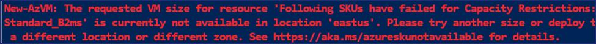

**Note –** If you receive error for VM size, you can replace the code
with one of the below

- Standard_D2ps_v5

- Standard_D2pds_v5

    

10. Once the deployment is completed it will show the below

    

11. Run the below command to connect to the Ubuntu VM, substitute the
    command using the **FullyQualifiedDomainName** from the output of
    the previous command

    `ssh postgres@FullyQualifiedDomainName`

    

12. When prompted to continue type **yes** and then enter the password
    provided in during the deployment - `P@55w.rd1234`

13. It should successfully connect to the Ubuntu Server

    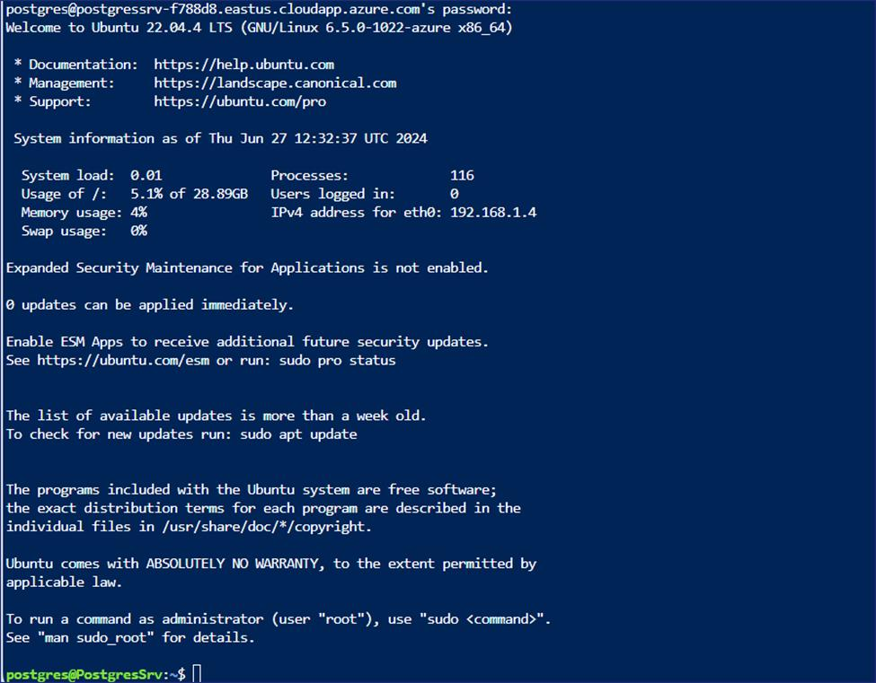

14. Now we will install PostgreSQL ver. 16 on the Ubuntu VM, we will set
    the automated repository configuration by running the below command

    `sudo apt install -y postgresql-common`

    `sudo /usr/share/postgresql-common/pgdg/apt.postgresql.org.sh`

    

    

15. Press the Enter key on keyboard to continue.

    

    

16. We will import the repository signing key by running the below
    commands.

    `sudo apt install curl ca-certificates`

    `sudo install -d /usr/share/postgresql-common/pgdg`

    `sudo curl -o /usr/share/postgresql-common/pgdg/apt.postgresql.org.asc --fail https://www.postgresql.org/media/keys/ACCC4CF8.asc`

    

17. We will run the below command to create the repository configuration
    file

    `sudo apt update`

    `sudo apt install gnupg2 wget`

    `sudo sh -c 'echo "deb http://apt.postgresql.org/pub/repos/apt $(lsb_release -cs)-pgdg main" > /etc/apt/sources.list.d/pgdg.list'`

    `curl -fsSL https://www.postgresql.org/media/keys/ACCC4CF8.asc | sudo gpg --dearmor -o /etc/apt/trusted.gpg.d/postgresql.gpg`

    

18. We will run the below command to update the package lists

    `sudo apt update`

    

19. We will run the below command to install the latest version of
    PostgreSQL

    `sudo apt install postgresql-16 postgresql-contrib-16`

    

    > **Note** – The installation should complete in 1-2 minutes

    

    

20. Once the installation is completed, type the below command to launch
    the PSQL utility

    `psql`

    

21. We will set the password for the postgres account in psql

    `\password postgres`

22. Provide the password as **postgres** Enter it again as **postgres**

    

23. Now we will set the network and other permissions to all the
    PostgreSQL to be accessed remotely

24. Run the below command to access the postgresql.conf file

    `\q`

    `sudo nano /etc/postgresql/16/main/postgresql.conf`

25. Once the file is opened scroll down and update the setting to match
    the below

    - Under Connection Settings remove the \# and change
      listen_addresses = '\*'

    

    - Under WRITE-AHEAD LOG remove the \# and change wal_level = logical

    

26. Once the above change is done press **Ctrl + X**

    

27. Press type **Y** and enter to confirm.

28. Run the below command to access the **pg_hba.conf** file

    `sudo nano /etc/postgresql/16/main/pg_hba.conf`

29. Once the file is opened scroll down add the below lines at the
    bottom of the file

    `host all all 0.0.0.0/0 md5`

    `host all all ::/0 md5`

    

30. Once the above change is done press **Ctrl + X**

    

31. Press type **Y** and enter to confirm.

32. Run the below command to restart the PostgreSQL service

    `sudo service postgresql restart`

    

33. On the Azure Portal, search and select Resource groups

    

34. From the list of Resource groups select PostgresRG, then select the
    VM - **PostgresSrv**

35. On the **PostgresSrv** page, select **Networking setting** and then
    click on **+ Create port rule** and choose **Inbound port Rule**

    

36. On the **Add inbound security rule** page, under service from the
    drop-down choose **PostgreSQL** and then click on
    the **Add** button.

    

37. You should receive the notification as shown in below image.

    

38. Now the PostgreSQL server is ready to be accessed remotely.

### Task 5 – Create a PostgreSQL database for the On-premises environment.

1.  Now we will import a sample database into the PostgreSQL server
    which we will use for Migration

2.  There are 15 tables in the DVD Rental database

    

3.  From the Azure Portal open the **Azure Cloud Shell**

    

4.  Ensure the Cloud Shell has launched with Bash, then run the below
    command to connect to the PostgresSrv VM

    `ssh postgres@`**ServerDNSName**

    

5.  When prompted to continue type yes and then enter the password
    provided in during the deployment - **P@55w.rd1234**

6.  It should successfully connect to the Ubuntu Server

    

7.  On the prompt postgres@PostgresSrv run the below command to create a
    folder to copy the file to be used for restoring the database.

    `mkdir dvdrentalbkp`

    

8.  On the Lab VM, right-click on the Start menu and **select Windows
    Terminal (admin)**

    

9.  In the Windows PowerShell window run the command to copy the
    PostgreSQL database backup to the folder dvdrentalbkp on the
    PostgresSrv.

    `scp "C:\Labfiles\dvdrental.tar"
    postgres@YOURPOSTGRESDNSNAME:"dvdrentalbkp"`

    When prompted to continue type yes and then enter the password
    - P@55w.rd1234

    

10. Switch back to the tab on the prompt postgres@PostgresSrv run the
    below command to launch PSQL

    `psql`

    

    On the psql prompt run the below command to create a database

    `CREATE DATABASE dvdrental;`

    

    `\q`

    

11. Back on postgres@PostgresSrv prompt type the below command to
    restore the backup into the newly created database.

    `cd dvdrentalbkp`

    `pg_restore -U postgres -d dvdrental "dvdrental.tar"`

    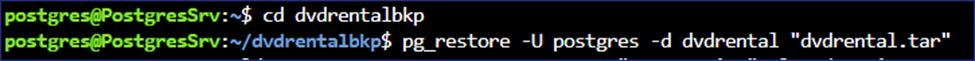

**Note –** if any error or warning message appear, they can be safely
ignored, and the blank database is updated with 15 Tables.

12. We can check the database details by running the below commands

    `psql`

    `\c dvdrental`

    

    `\dt`

    

### Summary

At the end of the Lab we should have successfully deployed the ARM
template and then **wait for 1 hour** the Scripts to run on the
deployed VM to ensure that the On-premise environment is created
properly.
