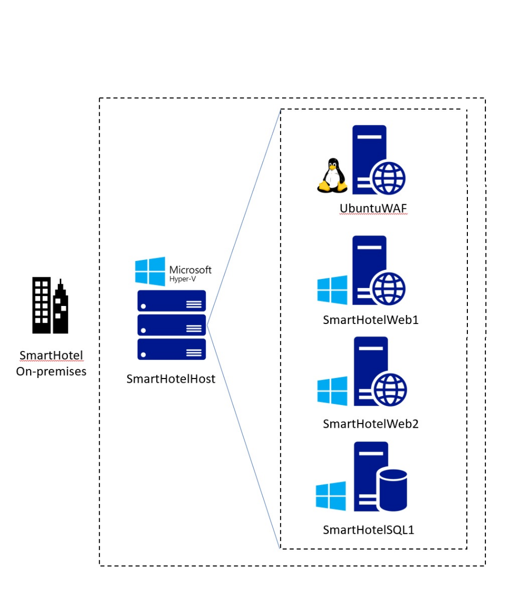

# Lab 02 - Verifying deployed on-prem environment and Landing zone

## Objective

In this Lab we would verify the deployed on-premises environment by
first checking the Public IP of the **SmartHotelHost** VM in any browser
to launch the **Smart Hotel Application**, if the on-premises has been
deployed successfully we should see the Smart Hotel application page
showing **Check in** and **Checked Out** guest count.

    

The landing zone that is created on Azure can be verified by checking
the **SmartHotelRG** resource group and checking that the
required **Network resources** are deployed.

### Task 1: Verify the on-premises environment

1.  On your Lab VM open a browser and navigate
    to `https://portal.azure.com` login using the **Office 365
    Tenant Credential** from the **Home/Resources tab** of the Lab
    interface.

2.  Select **Resource group** on home page.

    

3.  Select **SmartHotelHostRG**.

    

4.  Select **SmartHotelHost** VM that was deployed by the template in
    the previous module.

    

5.  Make a note of the **public IP address**.

    

6.  Open a browser tab and navigate to **Public IP of the
    SmartHotelHostVM** (noted in the previous step ). You should see
    the **SmartHotel** application, which is running on nested VMs
    within Hyper-V on the SmartHotelHost. (The application doesn't do
    much: you can refresh the page to see the list of guests or
    select **'CheckIn'** or **'CheckOut'** to toggle their status.)

    

    > **Note:** If the **SmartHotel application** is **not** shown, wait 10
    minutes and try again. It takes **at least 1 hour** from the start of
    template deployment. You can also check the CPU, network and disk
    activity levels for the **SmartHotelHost** VM in the Azure portal, to
    see if the provisioning is still active.

You have completed this task. Do not close this tab to proceed ahead
with the next task.

### Task 2: Verify the landing zone environment

1.  Switch back to **SmartHotelHost** VM tab and select **Home**.

    

2.  Select **Resource Groups** service.

    

3.  Select **SmartHotelRG** resource group.

    

4.  Note that the **Virtual Network**, **Bastion
    resource**, **Application Gateway**, **SQL
    Server** and, **Database** are available.

    

    

### Summary

At the end of the Lab, we should have successfully verified the
On-premises **Smart Hotel Application** which should be up and running.
The **Azure Landing zone resource** should be deployed which comprises
of Virtual Network, Azure Bastion, Application Gateway, and an Azure SQL
Server with an Azure SQL Database.

**Smart Hotel Application**

**Azure Landing zone** resource in the **SmartHotelRG**

