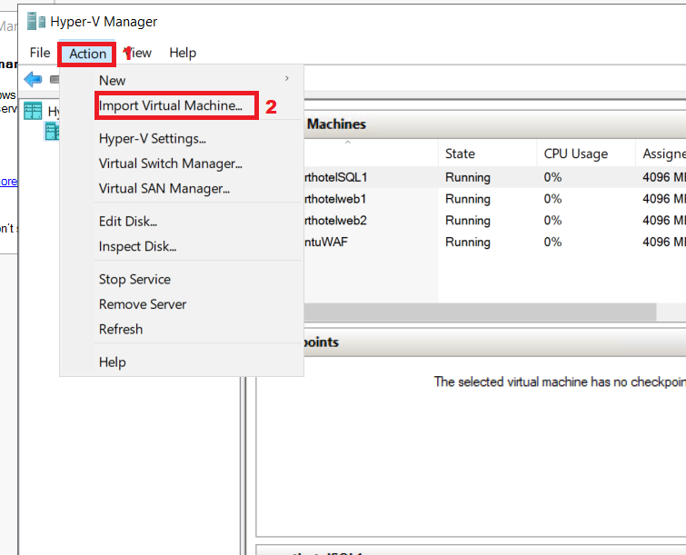
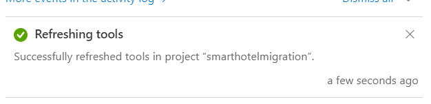
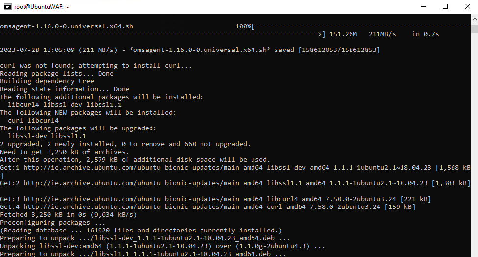

# Lab 03 - Discovering and assessing the on-premises environment.

**Objective**

In this Lab we would discover and then assess the on-premises VMs using
the Azure Migrate Tools and create a repository to store the assessment
data in an Azure Migration Project.

We would also install agents to discover and visualize the Dependency
across the VMs

To do so, we need to deploy the Azure Migrate Appliance as a VM on the
SmartHotelHost, then run the required Discovery tasks.

> **Important**: You should have allowed at least 60 minutes to deploy the on-premises
environment (**Lab 1- Deploying the on-premises environment and landing zone**) before you start this lab.

### Task 1: Create the Azure Migrate project and add assessment and migration tools

In this task, you will create the Azure Migrate project and select the
assessment and migration tools.

> **Note**: In this lab, you will use the Microsoft-provided assessment
and migration tools within Azure Migrate. A number of third-party tools
are also integrated with Azure Migrate for both assessment and
migration. You may wish to spend some time exploring these third-party
options outside of this lab.

1.  Switch back to **Azure portal** tab or open new tab and navigate
    to `https://portal.azure.com` and log in with your **Office 365
    tenant credentials**.

2.  In search bar type `Azure Migrate` and select **Azure
    Migrate** to open the **Azure Migrate Overview** blade, shown below.

    

    

3.  Select **Discover, assess and migrate**.

    

4.  Select **Create project**.

    

5.  Select **Azure Pass - Sponsorship** as your subscription and create
    a new resource group named `AzureMigrateRG`

    

6.  Enter `SmartHotelMigration` as the migration project name, and
    choose a geography close to you to store the migration assessment
    data. Here we are selecting **United States**. Then
    select **Create**.

    

    

7.  The Azure Migrate deployment will start. Once it has completed, you
    should see the **Azure Migrate: Discovery and
    assessment** and **Azure Migrate: Server Migration** panels for the
    current migration project, as shown below.

    

You have completed this task. Do not close this tab to proceed ahead
with the next task.

In this task you created an **Azure Migrate project**, using the default
built-in tools for server assessment and server migration.

### Task 2: Deploy the Azure Migrate appliance

In this task, you will deploy and configure the Azure Migrate appliance
in the on-premises Hyper-V environment. This appliance communicates with
the Hyper-V server to gather configuration and performance data about
your on-premises VMs, and returns that data to your Azure Migrate
project.

1.  Under **Azure Migrate: Discovery and Assessment**,
    select **Discover** and choose **Using appliance** to open
    the **Discover machines** blade.

    

2.  Under **Are your servers virtualized?**, select **Yes, with
    Hyper-V**.

    

3.  In **1: Generate project key**,
    provide `SHApplXXXXXX` (substitute **XXXXXX** with random
    number) as name for the Azure Migrate appliance that you will set up
    for discovery of Hyper-V VMs. Select **Generate key** to start the
    creation of the required Azure resources.

    

    

4.  **Wait** for the key to be generated, then copy the **Azure Migrate
    project key** to your clipboard and save it
    to **notepad.** This **Key** to use them in further Tasks.

    

5.  Ensure that the **.VHD file 12 GB** radio button is selected, then
    right-click on the **Download** button and select the **Copy
    link** option.

    

6.  Copy the link in notepad to be used later for downloading the Azure
    Migrate appliance.

    

7.  In a separate browser tab, navigate to the **Azure portal**. In the
    global search box, enter `SmartHotelHost` then select
    the **SmartHotelHost** virtual machine.

    

8.  Select **Connect**, choose **Connect** from the drop-down.

    

9.  Select **Download RDP File**.

    

10. Click on the **Keep** button for the notification and then click
    on **Open file** to connect.

    

11. **Connect** to the virtual machine using username `demouser` and
    password `demo!pass123`

    

    

12. Select **Yes**.

    

13. Open the Chrome browser on the **SmartHotelHost** VM and paste the
    copied link for the Azure Migrate appliance from the Notepad, it
    should start downloading the file

    

14. Once the file is downloaded, click on the downloaded file, choose
    the option **Shown in folder.**

    

15. Double-click on the zip file - **AzureMigrateAppliance**

    

16. Once the Folder **AzureMigrateAppliance** shows select it and then
    click on **Extract all** button and then provide the folder path
    as `F:\VirtualMachines` and click on **Extract** button.

    

17. Switch to the **Server
    Manager** window.     

18. In Server Manager, select **Tools**, then **Hyper-V Manager** (if
    Server Manager does not open automatically, open it by
    selecting **Start**, then **Server Manager**).

    

19. In Hyper-V Manager, select **SMARTHOTELHOST**. Now see a list of the
    four VMs that comprise the on-premises **SmartHotel** application.

    

20. In Hyper-V Manager, under **Actions**, select **Import Virtual
    Machine…** to open the **Import Virtual Machine** wizard.

    

21. At the first step, **Before You Begin**, select **Next**.

    

22. At the **Locate Folder** step, select **Browse** and navigate
    to `F:\VirtualMachines\AzureMigrateAppliance` (Ensure to select
    the one which was just ***extracted*** in previous steps), then
    choose **Select Folder**, then select **Next**.

    

23. At the **Select Virtual Machine** step,
    the **AzureMigrateAppliance** VM should already be selected.
    Select **Next**.

    

24. At the **Choose Import Type** step, keep the default
    setting **Register the virtual machine in-place**. Select **Next**.

    

25. At the **Connect Network** step, you will see an error that the
    virtual switch previously used by the Azure Migrate appliance could
    not be found. From the **Connection** drop down, select the **Azure
    Migrate Switch**, then select **Next**.

    

    > ***Note***: The Azure Migrate appliance needs access to the Internet to
    upload data to Azure. It also needs access to the Hyper-V host. However,
    it does not need direct access to the application VMs running on the
    Hyper-V host. To protect the application environment, the Azure Migrate
    Appliance should be deployed to a separate subnet within Hyper-V, rather
    than in the same subnet as your application.

    > The Hyper-V environment has a NAT network using the IP address space
    192.168.0.0/16. The internal NAT switch used by the SmartHotel
    application uses the subnet 192.168.0.0/24, and each VM in the
    application has been assigned a static IP address from this subnet.

    > The Azure Migrate Appliance will be connected to a separate subnet
    192.168.1.0/24, which has been set up for you. Using the 'Azure Migrate
    Switch' connects the appliance to this subnet. The appliance is assigned
    an IP address from this subnet using a DHCP service running on the
    SmartHotelHost.

26. Review the summary page, then select **Finish** to create the Azure
    Migrate appliance VM.

    

27. In Hyper-V Manager, select the **AzureMigrateAppliance** VM, then
    select **Start** on the right.

    

You have completed this task. Do not close Hyper-V Manager to proceed
ahead with the next task.

**Task summary**

In this task you deployed the Azure Migrate appliance in the on-premises
Hyper-V environment.

### Task 3: Configure the Azure Migrate appliance

In this task, you will configure the Azure Migrate appliance and use it
to complete the discovery phase of the migration assessment.

1.  In Hyper-V Manager, select the **AzureMigrateAppliance** VM, Start
    and then select **Connect**.

    

2.  A new window will open showing the Azure Migrate appliance. Wait for
    the License terms screen to show, then select **Accept**.

    

3.  On the **Customize settings** screen, set the Administrator password
    to **demo!pass123** by typing the Password manually (twice). Then
    select **Finish**.

    > **Note**: When entering the password, the VM uses a US keyboard mapping.
    If you are using a non-US keyboard, some characters may be entered
    incorrectly. Select the 'eyeball' icon in the second password entry box
    to check the password has been entered correctly.

    

4.  At the **Connect to AzureMigrateAppliance** prompt, set the
    appliance screen size using the slider, then select **Connect**.

    

5.  Log in with the Administrator by typing the password
    manually **demo!pass123** (the login screen may pick up your local
    keyboard mapping, use the 'eyeball' icon to check).

    

6.  **Wait.** After a minute or two, the browser will open showing the
    Azure Migrate appliance configuration wizard (it can also be
    launched from the desktop shortcut).

    

7.  On opening of the appliance configuration wizard, a pop-up with the
    license terms will appear. Accept the terms by selecting **I
    agree**.

    

8.  Under **Set up prerequisites**, the following two steps to verify
    Internet connectivity and time synchronization should pass
    automatically.

    

9.  Paste the **Azure Migrate project key** copied from the Azure portal
    earlier, in the section **Verification of Azure Migrate project
    key**, then click on the **Verify** button.

    

    > **Note**: If you do not have the key, on the Azure Portal under Azure
    Migrate go to **Server Assessment \> Discover \> Manage existing
    appliances**, select the appliance name you provided at the time of key
    generation and copy the corresponding key.

10. Once the **Azure Migrate project key** is verified, an auto-update
    process will start.

    

11. If new update is installed, then click on the **Refresh** button to
    reload the page.

    

12. Click on **Login**, a pop up will open with a code.

    

13. A new window will open showing a Device code. Select **Copy code &
    Login.**

    

14. In the new browser windows, when prompted, paste the **Code** and
    select **Next**.

    

15. Enter your Azure portal credentials and select **Next**.
    Enter **Password** and select **Sign in.**

    > **Note –** Due to nested virtualization, the @ symbol will appear as 2.
    Hence correct the credentials, also ensure to type the Password using
    the Keyboard or you can switch to the Lab VM and paste the password in a
    notepad and copy it, the switch back to the SmartHotelVM and paste the
    password in the AzureMigrate appliance VM.

    

    

16. Select **Continue**.

    

    

17. Return to the **Azure Migrate Appliance** tab and the **Appliance
    registration** will start automatically.

    

18. Once the registration has completed, proceed to the next
    panel, **Manage credentials and discovery sources**.

    

19. In Manage credentials and discovery sources **Step 1: Provide
    Hyper-V host credentials**, select **Add credentials**.

    

20. Enter `hostlogin` as **Friendly name**, username `demouser`
    and type the password manually **demo!pass123** for the Hyper-V
    host/cluster that the appliance will use to discover VMs.
    Select **Save**.

    

    > **Note**: The Azure Migrate appliance may not have picked up your local
    keyboard mapping. Select the 'eyeball' in the password box to check the
    password was entered correctly.

    > ***Note:*** Multiple credentials are supported for Hyper-V VMs
    discovery, via the 'Add more' button.

21. In **Step 2: Provide Hyper-V host/cluster details**, select **Add
    discovery source** to specify the Hyper-V host/cluster IP
    address/FQDN and the friendly name for credentials to connect to the
    host/cluster.

    

22. Select **Add single item,** enter `SmartHotelHost` under 'IP
    Address / FQDN' and select **hostlogin** from the drop-down as the
    Map credentials then **Save**.

    

    > **Note:** You can either **Add single item** at a time or **Add multiple
    items** in one go. There is also an option to provide Hyper-V
    host/cluster details through **Import CSV**.

23. The appliance will validate the connection to the Hyper-V
    hosts/clusters added and show the **Validation status** in the table
    against each host/cluster.

    

    > **Note:** When adding discovery sources:
    > - For successfully validated hosts/clusters, you can view more details
    by selecting their IP address/FQDN.
    >- If validation fails for a host, review the error by selecting the
    Validation failed in the Status column of the table. Fix the issue and
    validate again.
    > - To remove hosts or clusters, select **Delete**.
    > - You can't remove a specific host from a cluster. You can only remove
    the entire cluster.
    > - You can add a cluster, even if there are issues with specific hosts in
    the cluster.

1.  Ensure that the Switch is enabled, then click on **Add credentials**

    

2.  On the Add credentials pop-up provide the details and then click on
    the **Save** button.

    - Credential type – **Windows (Non-domain)**

    - Friendly name – `WindowsVM`

    - Username – `.\Administrator`

    - Password – type is manually **demo!pass123**

    

3.  Close the notification.

    

4.  Click on **Add credentials** again and on the Add credentials pop-up
    provide the details and then click on the **Save** button.

    - Credential type – **Linux (Non-domain)**

    - Friendly name – `LinuxVM`

    - Username – `.\demouser`

    - Password – type is manually **demo!pass123**

    

5.  Close the notification.

    

6.  Scroll down and then click on the **Start Discovery** button.

    

    

7.  Wait for the Azure Migrate status to show **Discovery has been
    successfully initiated**. This will take 10-13 minutes. After the
    discovery has been successfully initiated, you can check the
    discovery status against each host/cluster in the table.

    

8.  Switch back Lab VM, Open the Edge browser navigate to the Azure
    Portal `https://portal.azure.com` and sign in with your office
    365 tenant credentials and return to **Azure Migrate** blade.

    

9.  Select **Servers, databases and web apps** then select **Refresh**.

    

    

10. Under **Azure Migrate: Server Assessment** you should see a count of
    the number of servers discovered so far. If discovery is still in
    progress, select **Refresh** periodically until **5** discovered
    servers are shown. This may take several minutes.

    

**Important: Wait for the discovery process to complete before
proceeding to the next Task**.

You have completed this task, do not close this tab to proceed ahead
with the next task.

**Task summary**

In this task you configured the Azure Migrate appliance in the
on-premises Hyper-V environment and started the migration assessment
discovery process.

### Task 4: Import Servers inventory using a CSV file

You can also import an inventory of the environment, their
configuration, and utilization with a CSV file. The properties in the
CSV are:

- **Server Name** – name of the computer

- **IP Addresses** – semi-colon separated list of IPv4 and IPv6
  addresses used by the machine

- **Cores** – number of vCPU used

- **Memory** – amount of memory in MB

- **OS Details**

  - **Name** – type of operating system

  - **Version** – version of the OS in use

  - **Architecture** – architecture (like x64/x86)

- **CPU Utilization** – percentage of the CPU in use

- **Memory Utilization** – percentage spike of the CPU usage

- **Network**

  - Adapter count – number of NIC’s attached to the machine

  - Input Throughput – amount of throughput in Mbps into system

  - Output Throughput – amount of throughput in Mbps out of the system

- **Boot Type** – type of boot used by systems (UEFI/BIOS)

- **Disks**

  - **Number of disks** – number of disks attached to disk

  - **Per disk size** – size of disk in GB

  - **Per disk reads (Bytes)** – amount of MB per second read from each
    disk

  - **Per disk writes (Bytes)** – amount of MB per second written to
    each disk

  - **Per disk reads (IOPS)** – count of output operations from disk per
    second

  - **Per disk writes (IOPS)** – count of input operations from disk per
    second

Once the CSV is populated, you can then import the systems into the
Migrate assessment phase by doing the following:

1.  While in the **Azure Migrate** blade, under Migration goals, ensure
    that **Servers, databases and web apps** is selected, select
    the **Discover** button and choose **Using import**.

    

2.  Upload the CSV file named **Azure Migrate import
    template.csv** from `C:\Labfiles` and then select **Import** to
    read the file.

    

3.  The import should start processing the file records.

    

4.  You should get the notification as shown in below image

    

5.  In the import details we can see that **40 Records** were
    successfully inserted.

    

6.  Close the Discovery blade and then click on **Refresh** button.

    

7.  You should be able to see the Discovered Servers list is updated.

    - **Discovered Servers – 45**

    

8.  Click on **Discovered items**, then select the **Import based** tab,
    you should be able to see the details of the 40 imported servers.
    Ensure to select the Project from the drop-down menu.

    

You have completed this task, do not close this tab to proceed ahead
with the next task.

### Task 5: Build business cases for Cost estimation.

In this task, we will use Azure Migrate to Build Business Case using the
data gathered during the discovery phase from the Azure Migrate
appliance and from the Imported Servers list.

The Business case capability helps you build a business proposal to
understand how Azure can bring the most value to your business. It
highlights:

- On-premises vs Azure total cost of ownership.

- Year on year cashflow analysis.

- Resource utilization based insights to identify servers and workloads
  that are ideal for cloud.

- Quick wins for migration and modernization including end of support
  Windows OS and SQL versions.

- Long term cost savings by moving from a capital expenditure model to
  an Operating expenditure model, by paying for only what you use.

- Helps remove guess work in your cost planning process and adds data
  insights driven calculations.

- It can be generated in just a few clicks after you have performed
  discovery using the Azure Migrate appliance.

- The feature is automatically enabled for existing Azure Migrate
  projects.

1.  Click on **Servers, databases and web apps** under Migration goal,
    the select **Build business case** button.

    

2.  On the **Build business case (Preview)** page, provide the below
    details and then click on the **Build business case** button.

    - Business case name - `BCase1 from Imported CSV`

    - Target location - **West US**

    - Discovery source – **Build a quick business case using the servers
      imported via a .CSV file.**

    - Savings options – **Reserved instance + Azure Saving Plan**

    - Discount (%) on Pay as you go - **0**

    

3.  We should get the notification as shown below

    

4.  After few minutes click on the Refresh button

    

5.  Once the Assumptions are calculated the page should appear as below

    

6.  Review the details under the **TCO comparison** and the click
    on **View Details** link.

    

7.  It will open the Business case reports – **On-premises vs Azure**,
    which should show you the **Estimated annual cost by category**.

    

8.  Scroll down to see the **Total cost of ownership** details

    

9.  Back on the Overview page of the Business Case, review the **YoY
    estimated current vs future state cost** and **Savings with Azure
    Hybrid Benefit**

    

    > **Note** - As you plan to migrate to Azure in phases, this line chart
    shows your cashflow per year based on the estimated migration completed
    that year. By default, it is assumed that you will migrate 0% in the
    current year, 20% in Year 1, 50% in Year 2 and 100% in Year 3. Current
    state cost shows how your net cashflow will be on-premises, given your
    infrastructure is growing 5% per year. The future state cost shows how
    your net cashflow will be as you migrate some percentage to Azure per
    year as in the 'Azure cost' assumptions, while your infrastructure is
    growing 5% per year.

    > **Note** - **Azure Hybrid Benefit** is a licensing benefit that helps
    you to significantly reduce the costs of running your workloads in the
    cloud. It works by letting you use your on-premises Software
    Assurance-enabled Windows Server and SQL Server licenses on Azure.

10. Review the information provided under the Discovery insights section

    - **Total Server – Distribution**

    - **OS Distribution**

    

11. Click on the **Azure IaaS**, review the **Azure** tab which provides
    information for the Servers which are **Ready for migration** and
    also the **IaaS cost estimate** for the same and the **Saving with
    Azure Hybrid Benefit**.

    

12. Scroll down for more details on

    - **Estimated cost by savings option**

    - **Suggested VM family and Storage type**

    - **On-premises cost vs Azure cost**

    

13. Scroll up and click on the **On-premises** tab, it will show
    the **On-premises cost estimate**

    

14. Scroll down and check the Server analysis section showing

    - **Distribution by operating system**

    - **Distribution by virtualization**

    - **Distribution by category**

    

15. Click on the **View details** link under End of Support, it will
    list of all servers considered in the business case
    with **recommended targets, activity state** and **qualifying offers
    in Azure**.

    

16. Close the Details blade and then click on **Azure cost** under
    Assumptions.

    

17. Here you can modify the **Assumptions for Azure cost** and **Cost
    modelling** and then click on **Save** to reassess the Business
    case.

18. Click on **On-premises cost**, on the **Compute** tab you have the
    settings for

    - **Software - SQL Server licensing**

    - **Software - Windows server licensing**

    - **Virtualization software – Hyper-V**

    - **Virtualization software – VMware**

    

19. Click on the **Storage** tab to check the settings

    

20. Click on the **Network** tab to check the settings

    

21. Click on the **Security** tab to check the settings

    

22. Click on the **Labor** tab to check the settings

    

23. Click on the **Facilities** tab to check the settings

    

24. The proper On-premises cost can be estimated by making changes in
    these setting and then click on Save button to reassess the
    On-premises cost.

25. Now let’s create another Business case for the Servers discovered
    using the Azure Migrate appliance.

26. From the Azure Migrate page, click on Servers, databases and web
    apps and then click on **Build Business case**

    

27. On the **Build business case (Preview)** page, provide the below
    details and then click on the **Build business case** button.

    - Business case name - `BCase2 Migrate Appliance`

    - Target location - **West US**

    - Discovery source – **Use more accurate data insights collected via
      the Azure Migrate appliance.**

    - Migration strategy - **Azure recommended approach to minimize
      cost**

    - Savings options – **Reserved instance + Azure Saving Plan**

    - Discount (%) on Pay as you go - **0**

    

28. We should get the notification as shown below

    

29. After few minutes click on the Refresh button

    

30. Once the Assumptions are calculated the page should appear as below

    

31. Similar to the Business Case created for the Imported Servers, you
    can review the Details of this Business case for the below areas.

    - **TCO comparison**

    - **Discovery insights**

    - Business case reports

      - **On-premises vs Azure**

      - **Azure IaaS**

    - Assumptions

      - **Azure cost**

      - **On-premises cost**

32. Once the **BCase2 Migrate Appliance** – Business Case is reviewed,
    back on the Azure Migrate page, click on **Overview** button under
    the **Servers, databases and web apps.**

    

33. Click on **Business cases** under Manage.

    

34. We should be able to see the 2 Business cases created from different
    Discovery sources.

    - Import

    - Appliance

    

### Task 6: Create a migration assessment

In this task, you will use Azure Migrate to create a migration
assessment for the **SmartHotel** application, using the data gathered
during the discovery phase.

1.  In Azure Migrate select **Assess -\> Azure VM** under **Azure
    Migrate: Discovery and assessment** to start a new migration
    assessment.

    

2.  On the **Create Assessment Basics** blade, provide the below details

    - Assessment type - **Azure VM**

    - Discovery Source - **Servers discovered from Azure Migrate
      Appliance**.

    - Under Assessment settings – click on the **Edit** link

    

3.  The **Assessment settings** blade allows to tailor many of the
    settings used when making a migration assessment report. Take a few
    moments to explore the wide range of assessment properties.

4.  Then make the below changes and click on the **Save** button.

    - Target location – **West US** (Region in which the Subscription
      vCPU cores were increased)

    - Saving options – **3 Years reserved**

    - Percentile utilization – **99^(th)**

    - VM series – **Select All**

    

**Note:** You have to make a change for the **Save** button to be
enabled; if you don't want to make any changes, just close the blade.

5.  Back on the Basics tab, click on the **Next**: **Select servers to
    assess \>** button.

    

6.  Enter **Assessment name** as **SmartHotelAssessment**.
    Choose **Create New** and enter the group name **SmartHotel VMs**.
    Select
    the **smarthotelweb1**, **smarthotelweb2** and **UbuntuWAF** VMs
    then select **Next: Review+ Create assessment** button.

    

    > **Note**: There is no need to include the smarthotelSQL1 or
    AzureMigrateAppliance VMs in the assessment, since they will not be
    migrated to Azure. (The SQL Server will be migrated to the SQL Database
    service and the Azure Migrate Appliance is only used for migration
    assessment.)

7.  Select **Create assessment**.

    

8.  On the **Azure Migrate - Servers, databases and web apps** blade,
    select **Refresh** periodically until the number of assessments
    shown is 1. This may take 5-6 minutes.

9.  On the Azure Migrate Server, databases and web app page under
    Assessment select 1.

    

10. Click on the **SmartHotelAssessment** from the list.

    

11. Take a moment to study the assessment overview.

    

12. Select **Settings**.

    

13. In the Assessment setting change the below and then click on
    the **Save** button.

    - Performance History – **1 Week**

    - Percentile utilization – **95^(th)**

    

14. After a few moments, the assessment report will update to reflect
    your changes.

    

15. **Comparison** as shown in below image.

    

16. Select **Azure readiness** (either the chart or on the left
    navigation). Note that for the **UbuntuWAF** VM, a specific concern
    is listed regarding the readiness of the VM for migration.

    

    > Take a few minutes to explore other aspects of the migration assessment.

    > **Note**: The process of gathering information of operating system
    environments (OSE) and migrating data of VMs between environments takes
    some time due to the nature of transferring data. However, there are a
    few steps that can be done to speed up and view how the system works.
    These are a few options:

    > Common steps to refresh data: (also see Troubleshoot Discovery)

    > - Server data not updating in portal – if the servers’ data is not
    refreshing, this is a method to accelerate it.

    > - Do not see software inventory details – by default the software
    inventory is only refreshed once every 24 hours. This forces a
    refresh.

    > - Software inventory errors – during inventory there are sometimes error
    codes returned. This lists all the error codes and meanings.

    > Many issues in the Migrate can be related to the appliance not
    refreshing the data due to regular schedules or data not being
    transferred. Forcing the data and information to be updated can be
    achieved with the following steps:

21. In **Azure Migrate** page in **Servers, database and web
    apps**, **Azure Migrate: Discovery and assessment**,
    select **Overview**.

    

22. Under **Manage**, select **Appliances**. Select **Refresh
    services**.

    

    

23. Wait for the refresh operation to complete. You should now see
    up-to-date information.

    

You have completed this task. Do not close this tab to proceed ahead
with the next task.

**Task summary:**

In this task you created and configured an Azure Migrate migration
assessment.

### Task 7: Configure dependency visualization

When migrating a workload to Azure, it is important to understand all
workload dependencies. A broken dependency could mean that the
application doesn't run properly in Azure, perhaps in hard-to-detect
ways. Some dependencies, such as those between application tiers, are
obvious. Other dependencies, such as DNS lookups, Kerberos ticket
validation or certificate revocation checks, are not.

In this task, you will configure the **Azure Migrate dependency
visualization** feature. This requires you to first create a **Log
Analytics workspace**, and then to deploy agents on the to-be-migrated
VMs.

1.  While still in the **Azure Migrate** page, Select **Servers,
    database and web apps**. Under **Azure Migrate: Discovery and
    assessment** Click on the number **1** link under **Groups**.

    

2.  Select the **SmartHotel VMs** group to see the group details.

    

3.  Note that each VM has their **Dependencies** status as **Requires
    agent installation**. Select **Requires agent installation** for
    the **smarthotelweb1** VM.

    

4.  On the **Dependencies** blade, select **Configure Log Analytics
    workspace**.

    

5.  Create a new Log Analytics workspace.
    Use `AzureMigrateWSXXXXXX` \[Substitute **XXXXXX** with random
    number\] , as the workspace name. Choose Log Analytics workspace
    location – **West US**, then select **Configure**.

6.  Wait for the workspace to be deployed. Make a note of
    the **Workspace ID** and **Workspace Key** in Notepad.

    

7.  Right-click and copy the link address of each of the **4 agent
    download URLs** and paste them alongside the **Workspace ID and
    key** you noted in **notepad** the previous step 9.

    

    > **Note** : You can mail these links your test account and open it in VM.

11. Return to the RDP session of **SmartHotelHost** if prompted to
    connect use the credentials.

    - Username - `demouser`

    - Password - `demo!pass123`

12. In **Hyper-V Manager**, select **smarthotelweb1** and
    select **Connect**.

    

13. Select **Connect** again when prompted and log in to
    the **Administrator** account by typing the
    password **demo!pass123**

    

    

14. Open **Internet Explorer**

    

15. Paste the link to the **64-bit Microsoft Monitoring Agent for
    Windows** which you have saved earlier, when prompted click
    the **Run** button.

    

    > **Note:** You may need to disable **Internet Explorer Enhanced Security
    Configuration** on **Server Manager** under **Local Server** to complete
    the download.

16. On the Microsoft Monitoring Agent Setup, click on **Next** and then
    click on **I Agree.**

17. Proceed ahead with the default selections till the **Agent Setup
    Options** page. From there, select **Connect the agent to Azure Log
    Analytics (OMS)** and select **Next**.

    

18. Enter the Workspace ID and Workspace Key that you copied earlier and
    select **Azure Commercial** from the Azure Cloud drop-down.
    Select **Next**, select through the remaining pages
    and **install** the agent.

    

19. Continue the rest of the Setup with the default options, then click
    on **Finish**

    

20. Paste the link to the **Dependency Agent Windows installer** into
    the browser address bar. **Run** the installer and select through
    the install wizard to complete the installation.

    

    > **Note:** You do not need to configure the workspace ID and key when
    installing the Dependency Agent, since it uses the same settings as the
    Microsoft Monitoring Agent, which must be installed beforehand.

    

21. Close the virtual machine connection window for
    the **smarthotelweb1** VM.

22. In **Hyper-V Manager**, select **smarthotelweb2** and
    select **Connect**.

    

23. Select **Connect** again when prompted and log in to
    the **Administrator** account by typing the
    password **demo!pass123**

    

    

24. Open **Internet Explorer**, and, which you noted earlier. When
    prompted, **Run** the installer.

    

25. Close the virtual machine connection window for
    the **smarthotelweb2** VM.

26. Paste the link to the **64-bit Microsoft Monitoring Agent for
    Windows** which you have saved earlier, when prompted click
    the **Run** button.

    

    > **Note:** You may need to disable **Internet Explorer Enhanced Security
    Configuration** on **Server Manager** under **Local Server** to complete
    the download.

27. On the Microsoft Monitoring Agent Setup, click on **Next** and then
    click on **I Agree.**

28. Proceed ahead with the default selections till the **Agent Setup
    Options** page. From there, select **Connect the agent to Azure Log
    Analytics (OMS)** and select **Next**.

    

29. Enter the Workspace ID and Workspace Key that you copied earlier and
    select **Azure Commercial** from the Azure Cloud drop-down.
    Select **Next**, select through the remaining pages
    and **install** the agent.

    

30. Continue the rest of the Setup with the default options, then click
    on **Finish**

    

31. Paste the link to the **Dependency Agent Windows installer** into
    the browser address bar. **Run** the installer and select through
    the install wizard to complete the installation.

    

    > **Note:** You do not need to configure the workspace ID and key when
    installing the Dependency Agent, since it uses the same settings as the
    Microsoft Monitoring Agent, which must be installed beforehand.

    

    > You will now **deploy** the **Linux versions of the Microsoft Monitoring
    Agent** and Dependency Agent on the **UbuntuWAF** VM. To do so, you will
    first connect to the **UbuntuWAF** remotely using an **SSH session**.

32. Return to the RDP session with the **SmartHotelHost** and open a
    command prompt using the desktop shortcut.

    

    > **Note**: The **SmartHotelHost** runs Windows Server 2019 with the
    Windows Subsystem for Linux enabled. This allows the command prompt to
    be used as an SSH client. More info of supported Linux on Azure can be
    found here: `https://Azure.com/Linux`

33. Enter the following command to connect to the **UbuntuWAF** VM
    running in Hyper-V on the SmartHotelHost Use the following command

    `ssh demouser@192.168.0.8`

34. Enter **'yes'** when prompted whether to connect. Use the
    password **demo!pass123**.

    

35. Enter the following command, followed by the
    password **demo!pass123** when prompted:

    `sudo -s`

    

36. This gives the terminal session **elevated/root privileges**

37. Enter the following command, substituting \\and \\with the values
    copied previously.

    `wget https://raw.githubusercontent.com/Microsoft/OMS-Agent-for-Linux/master/installer/scripts/onboard_agent.sh && sh onboard_agent.sh -w <Workspace ID> -s <Workspace Key> -d opinsights.azure.com`

38. When Prompted select Yes and then press enter

    

    

39. The installation screens should appear as below.

    

    

40. Enter the following command, substituting **< Workspace ID>** with the value copied earlier

    `/opt/microsoft/omsagent/bin/service_control
    restart <Workspace ID>`

    

41. Enter the following command to download the Dependency Agent for
    Linux.

    `wget --content-disposition https://aka.ms/dependencyagentlinux -O
    InstallDependencyAgent-Linux64.bin`

    

42. Install the dependency agent by running the below command.

    `sh InstallDependencyAgent-Linux64.bin -s`

    

43. The agent installation is now complete.

Next, you need to generate some traffic on the SmartHotel application so
the dependency visualization has some data to work with. Browse to the
public IP address of the SmartHotelHost, and spend a few minutes
refreshing the page and checking guests in and out.

**Task summary**

In this task you configured the Azure Migrate dependency visualization
feature, by creating a Log Analytics workspace and deploying the Azure
Monitoring Agent and Dependency Agent on both Windows and Linux
on-premises machines.

### Task 8: Explore dependency visualization

In this task, you will explore the dependency visualization feature of
Azure Migrate. This feature uses data gathered by the dependency agent
you installed previous task.

1.  Switch back to the Azure Portal with the **Azure Migrate** page
    open, select **Servers, database and web apps**. Under **Azure
    Migrate: Discovery and assessment** Click on the number **1** link
    under **Groups**.

    

2.  Select the **SmartHotel VMs** group to see the group details.

    

3.  Ensure that Dependency agent for all VMs is showing the status
    as **Installed**

    

4.  Click on **View dependencies**.

    

5.  Take a few minutes to explore the dependencies view. Expand each
    server to show the processes running on that server. Select a
    process to see process information. See which connections each
    server makes.

    

    

**Task summary**

In this task you explored the Azure Migrate dependency visualization
feature.

**Exercise summary**

In this exercise, you used Azure Migrate to assess the on-premises
environment. This included selecting Azure Migrate tools, deploying the
Azure Migrate appliance into the on-premises environment, creating a
migration assessment, and using the Azure Migrate dependency
visualization.

### Task 9: Stop on-premises environment VMs

1.  Select **Resource group** on home page.

    

2.  Select **SmartHotelHostRG** and then select **SmartHotelHost VM**.

    

3.  Select **SmartHotelHost VM**.

    

4.  Stop the VM if you would not be doing the next Labs the same day,
    this is to ensure we have sufficient credits to complete all Labs.

    

5.  Confirm by clicking on the OK button

    

6.  You should get the notification as shown in below image

    

    

    > **Note** – The SmartHotelHost VM is stopped as it is a Standard D8s VM
    which will consume Azure Pass credits if it is left running, which may
    result in insufficient credits to complete the remaining lab.

**Summary**

At the end of the Lab, we should have successfully discovered and
assessed the on-premises VMs using the Azure Migrate Appliance and the
Metadata should be available on the Azure Migrate Project with the
details as shown below

- Assessment of VMs

    

- Dependency Map of the VMs

    
