# Lab 08: Implementing RBAC and Azure backup

## Objective

In the lab we will be doing additional post-migration optimization with
the Security aspect, like working with the RBAC permission for Azure
resources, utilizing the Key Vault to store secret and using the stored
secrets in templated deployment.

We will also explore and configure Recovery Service Vault to store the
backup for the migrated VMs and checked the steps to eventually delete
the backup.

Lastly, we will enable Microsoft Defender for Cloud and do the necessary
configuration.

## Exercise 1: Assign Azure roles using the Azure portal

**Azure role-based access control (Azure RBAC)** is the authorization
system you use to manage access to Azure resources. To grant access, you
assign roles to users, groups, service principals, or managed identities
at a particular scope. This article describes how to assign roles using
the Azure portal.

### Task 1: Identify the needed scope

When you assign roles, you must specify a scope. Scope is the set of
resources the access applies to. In Azure, you can specify a scope at
four levels from broad to narrow: management group subscription,
resource group, and resource.

1.  Switch back to Azure portal tab or open new tab and navigate to
    **Azure portal** - `https://portal.azure.com`. Sign in with your
    Office 365 tenant credentials.

2.  In the Search box at the top, search for the scope you want to grant
    access to. For example, search
    for **Management groups**, **Subscriptions**, **Resource groups**,
    or a specific resource.

    

3.  Click the specific resource for that scope. The following shows an
    example resource group.

    

### Task 2: Open the Add role assignment page

**Access control (IAM)** is the page that you typically use to assign
roles to grant access to Azure resources. It's also known as identity
and access management (IAM) and appears in several locations in the
Azure portal. We will assign the Cost Management Contributor role to
allow to view and manage Cost configuration.

1.  Click **Access control (IAM)**. The following shows an example of
    the **Access control (IAM)** page for a resource group.

    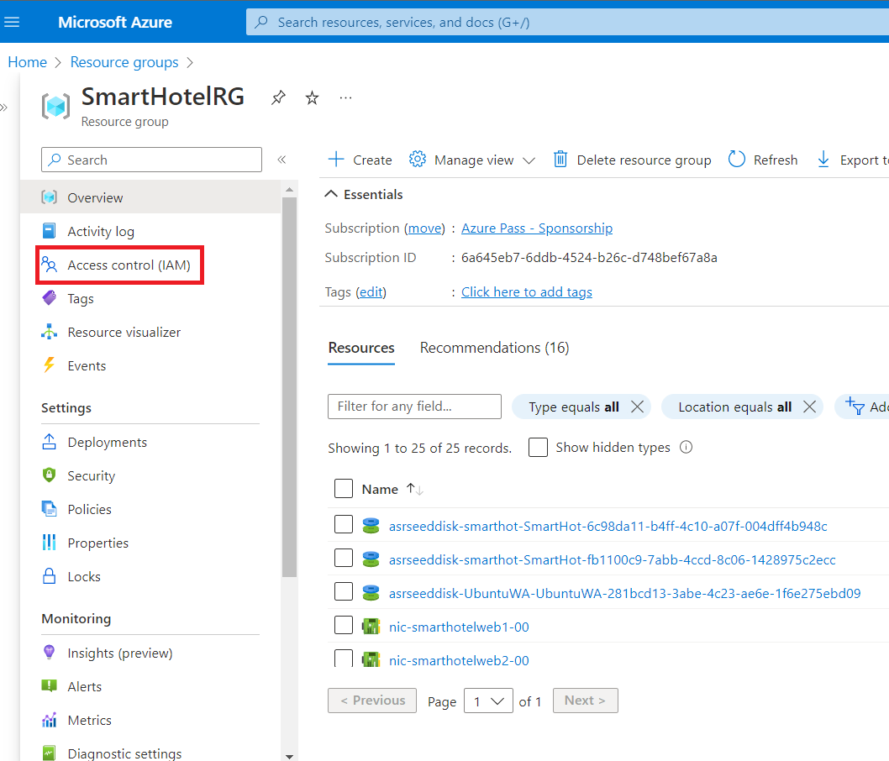

2.  Click the **Role assignments** tab to view the role assignments at
    this scope.

    

3.  Click **Add** \ **Add role assignment**. If you don't have
    permissions to assign roles, the Add role assignment option will be
    disabled.

    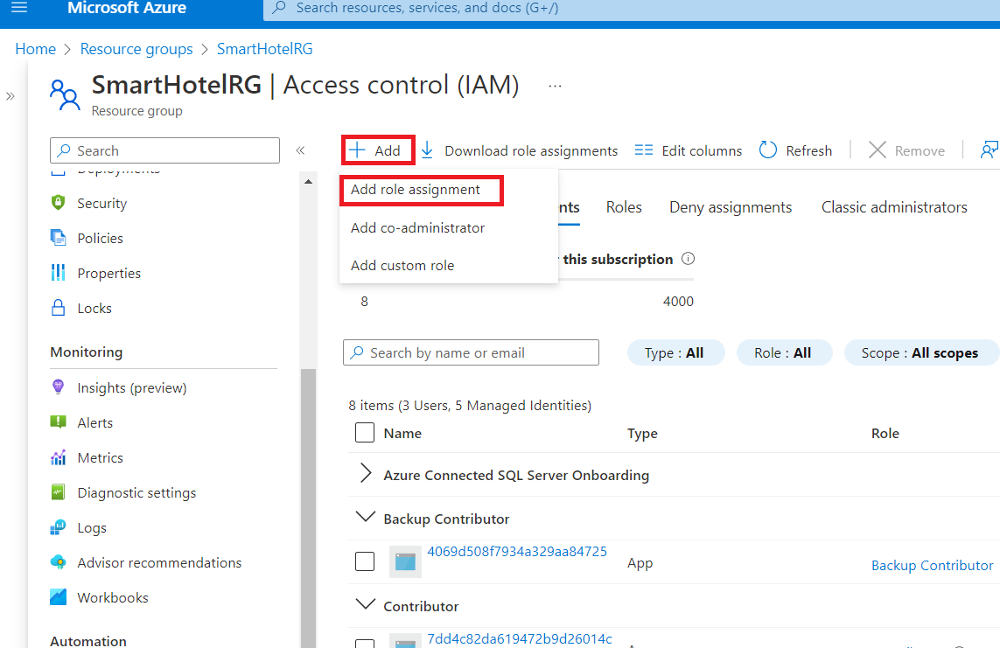

The **Add role assignment** page opens.

### Task 3: Select the appropriate role

1.  On the **Roles** tab, select a role that you want to use. You can
    search for a role by **name** or by **description**. You can also
    filter roles by type and category.

    

2.  In the search box type **cost** and then select the **Cost
    Management Contributor** role and click on **Next**.

    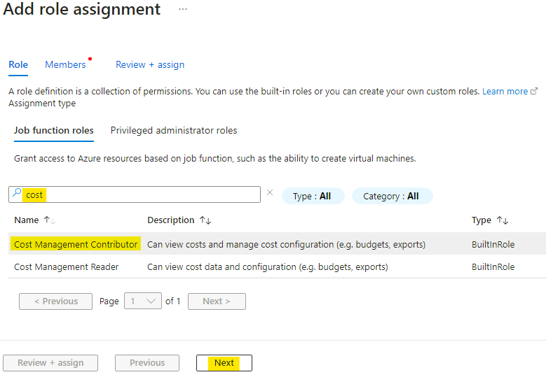

### Task 4: Select who needs access

1.  On the **Members** tab, select **User, group, or service
    principal** to assign the selected role to one or more Azure AD
    users, groups, or service principals (applications). Click **Select
    members**.

2.  From the listed member select **MOD Administrator** and then click
    on **Select**.

    

3.  Optionally you can assign the selected role to one or more managed
    identities, select **Managed identity**.

    

4.  In the **Description** box enter an optional description for this
    role assignment. Later you can show this description in the role
    assignments list.

    

5.  Click **Review + assign**.

### Task 5: Assign role

1.  On the **Review + assign** tab, review the role assignment settings.

    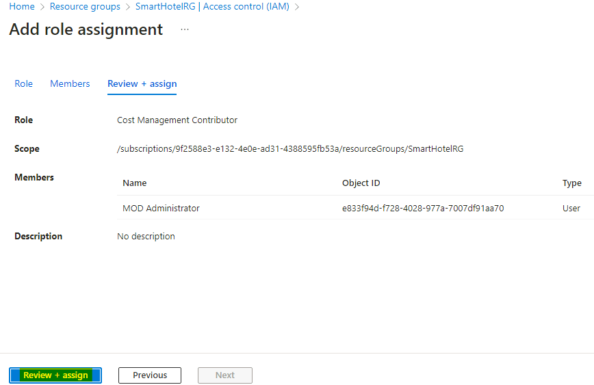

2.  Click **Review + assign** to assign the role. After a few moments,
    the security principal is assigned the role at the selected scope.

    

3.  If you don't see the description for the role assignment,
    click **Edit columns** to add the **Description** column.

## Exercise 2: Protecting Keys and Secrets with Key Vault

Azure Key Vault is a cloud service for securely storing and accessing
secrets. A secret is anything that you want to tightly control access
to, such as API keys, passwords, certificates, or cryptographic keys.

To do any operations with Key Vault, you first need to authenticate to
it.

We will perform a Deployment Lab where we will store
a **Secret/password** which we will use as a VM login password, when we
deploy the VM using an ARM-Template.

1.  On the Azure Portal, click on **+ Create a resource**, then
    type **Key Vault** and select it, then click on **Create**.

    

2.  On the Basics tab, provide the below details

    - Subscription – select your **Subscription**

    - Resource group – Create new – `RG4KeyVault`

    - Key vault name - `KeyVaultXXXXXX` \[Substitute **XXXXXX** with
      random number\]

    - Region – **West US**

    - Pricing tier – **Standard**

    - Click on **Next**

    

3.  On the **Access policy** tab, ensure to enable all 3 check boxes,
    then click **Review +** **create.**

    

4.  Click on **Create** after the Validation is passed.

    

5.  Click on **Go to resource** once the Deployment is completed.

    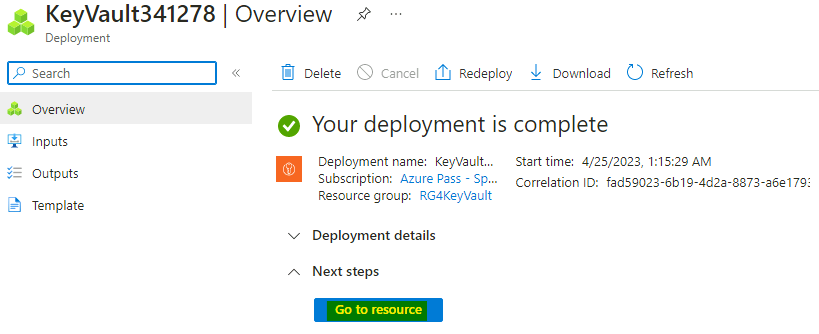

6.  Click on **Access Control (IAM)**, then select **+ Add** and
    choose **Add role assignment**

    

7.  Select the Role **Key Vault Administrator**, then click on **Next**

    

8.  Click on **+ Select members**, choose **MOD Administrator** account
    and click on **Select** button, then click on **Next**

    

9.  Click on **Review + assign** button

    

10. On the **KeyVault4Testing** click on **Secrets** under Objects, then
    click on + **Generate/Import**.

    

11. Provide the details as Name – **VMPassword**, Secret Value
    – **demo!pass123** then click on **Create**

    

12. Verify that the **Secret** is listed as shown.

    

13. Click on **Properties** under Settings, then copy the **Resource
    ID**, as it would be required for deployment of VM, you can save it
    in a notepad file.

    

14. Now we will gather the Template file for deployment.

15. Click on **+ Create a resource**, then in the search type **Windows
    10**, select **Microsoft Windows 10**.     

16. From drop down choose **Window 10 Pro, Version 22H2**, then click
    on **Create**.

    

17. On the Basics tab, provide the below and leave rest information as
    default

    - Subscription – select your **Subscription**

    - Resource group – **RG4KeyVault**

    - Virtual Machine name – `Win10VM1`

    - Region – **West US**

    - Security type – **Standard**

    > **Note** – If you did not change the Security type to Standard then the
    Backup task will fail

    - Username – `demouser`

    - Password – **enter any** **random** **password**.

    - Select check box “**I confirm I have an eligible Windows 10 license
    with multi-tenant hosting rights**”

    - Click on **Review + create**.

    

    

17. On the **Validation** page, click on **Download a template for
    automation**.

    

18. Click on **Download** again to download the template and
    parameter ***json files*** in the Zip format.

    

19. Open and extract the **template.zip** file on the Desktop.

    

20. Now open the **parameter.json** file in Notepad, we need to replace
    the highlighted section for the password.

    

21. We need to locate the following section:

    > "adminPassword": {
    >
    >"value": null
    >
    >},

22. Replace this with the following:

    #
        "adminPassword": {
        "reference": {
        "keyVault": {
        "id": "your KeyVaultID"
        },
        "secretName": "VMPassword"
        }
        },

23. Substitute the Key Vault resource ID collected earlier
    for **KeyVaultID** and the VM Password secret created in step no. 8
    for **KeyVaultSecret**. The final code should look like the
    following:

    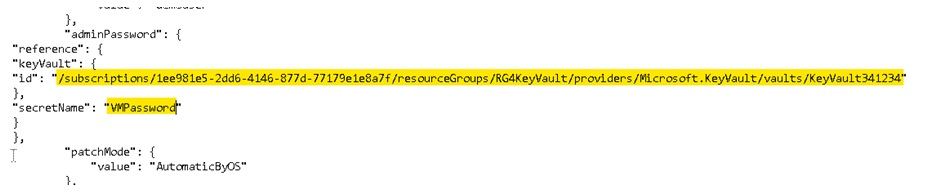

24. You can change other Parameters in the file to suit your deployment
    requirement, for this Lab let’s keep it simple.

25. **Save** the **parameter.json** file. We will now upload both the
    files to the Cloud drive.

26. Open the **Cloud Shell** in the Azure Portal.

27. Upload both the **JSON** files one by one using the upload button as
    shown in below image.

    

28. Type the below commands in the Cloud Shell to enable template
    deployment.

    `az keyvault update --name KeyVaultXXXXX
    --enabled-for-template-deployment true`

    > **Note** -Substitute **XXXXXX** with the random number of your key vault

    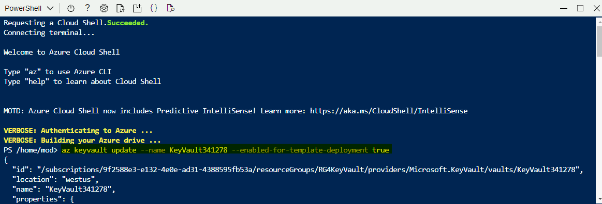

29. Run the below command to start the deployment.

    `az deployment group create --resource-group "RG4KeyVault"
    --template-file template.json --parameters parameters.json`

    > **Note** -Substitute **XXXXXX** with the random number of your key vault

    

    The Deployment has started and will take around **5-7** minutes to
    complete.

    

30. Once the Deployment is **Succeeded**, we can go to the Resource
    group **RG4KeyVault** and click on the **Deployed VM**.

    

31. On the **Win10VM1** page, click on **Connect**, the select **RDP**

    

    

32. Click on **Download RDP** file, run it and connect to the VM using
    the below details.

    - Username – `demouser`

    - Password – As specified in the **KeyVault** secret
      – `demo!pass123`

    

33. If all the configuration is done correctly then we should be able to
    login.

    

    

34. So, we have successfully utilized the Azure Key Vault to store are
    Secret password, which we have used for the Deployment.

You have completed this exercise. Please proceed ahead with the next
exercise.

## Exercise 3 -Back up a virtual machine in Azure

Azure backups can be created through the Azure portal. This method
provides a browser-based user interface to create and configure Azure
backups and all related resources. You can protect your data by taking
backups at regular intervals. Azure Backup creates recovery points that
can be stored in geo-redundant recovery vaults. This exercise details
how to back up an virtual machine (VM) with the Azure portal. This
quickstart enables backup on an existing Azure VM.

**Note**

The functionality described in the following sections can also be
accessed via **Backup center**. Backup center is a single unified
management experience in Azure. It enables enterprises to govern,
monitor, operate, and analyze backups at scale. With this solution, you
can perform most of the key backup management operations without being
limited to the scope of an individual vault.

### Task 1 : Create a Recovery Services vault

A Recovery Services vault is a management entity that stores recovery
points created over time and provides an interface to perform
backup-related operations. These operations include taking on-demand
backups, performing restores, and creating backup policies.

To create a Recovery Services vault:

1.  Switch back to Azure portal or navigate
    to `https://portal.azure.com` and sign in with your Office 365
    tenant credentials.

2.  Search for **Backup center** in the Azure portal, and go to
    the **Backup Center** dashboard.

    

3.  Select **+Vault** from the **Overview** tab.

    

4.  Select **Recovery Services vault** \ **Continue**.

    

5.  The **Recovery Services vault** dialog opens. Provide the following
    values:

    - Subscription: **Azure Pass - Sponsorship**

    - Resource group: select Create new : `Azurebackup-rg`

    - Vault name: `BkpVaultXXXXXX` (Substitute **XXXXXX** with random
    number).

    - Region: **East US**

    - After you provide the values, select **Review + create**.

    >***Important***
    >
    >*If you're not sure of the location of your data source, close the
    dialog. Go to the list of your resources in the portal. If you have data
    sources in multiple regions, create a Recovery Services vault for each
    region. Create the vault in the first location before you create the
    vault for another location. There's no need to specify storage accounts
    to store the backup data. The Recovery Services vault and Azure Backup
    handle that automatically.*

    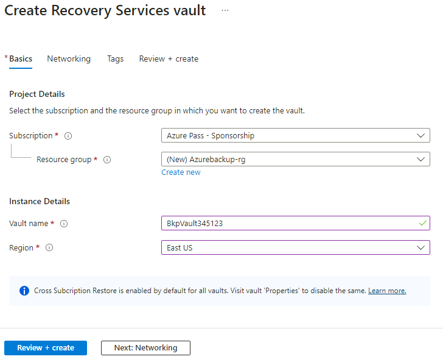

6.  When you're ready to create the Recovery Services vault,
    select **Create**.

    

7.  Wait for the deployment to complete.

    

### Task 2 : Apply a backup policy

To apply a backup policy to your Azure VMs, follow these steps:

1.  Go to **Backup center** and click **+Backup** from
    the **Overview** tab.

    

2.  Select **Azure Virtual machines** as the **Datasource type** and
    select the **vault** you have created. Then click **Continue**.

    

    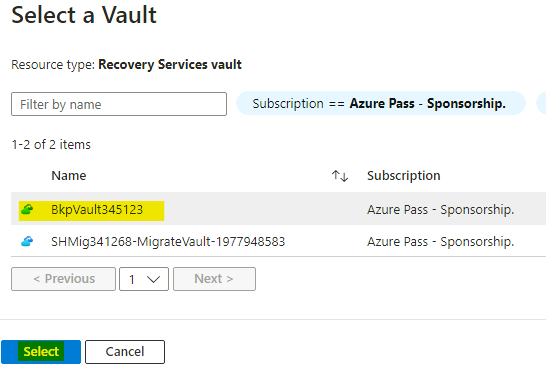

    

3.  Assign a **Backup policy**. The default policy backs up the VM once
    a day. The daily backups are retained for ***30 days***. Instant
    recovery snapshots are retained for two days.

    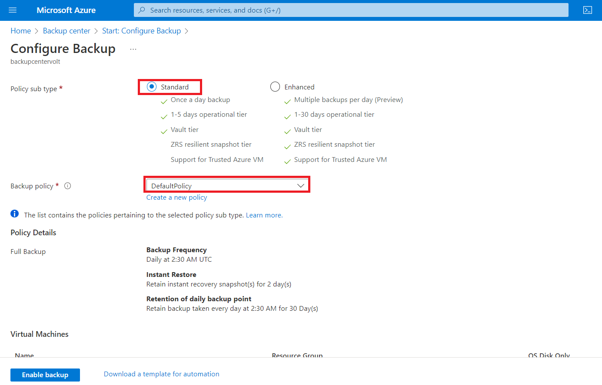

>**Note** : If you don't want to use the default policy, select **Create
New**, and create a custom policy as described in the next procedure.*

You have completed this task, please proceed ahead with the next task

### Task 3: Select a VM to back up

Create a simple scheduled daily backup to a Recovery Services vault.

1.  Under **Virtual Machines**, select **Add**.

2.  The **Select virtual machines** pane will open. Select the VMs you
    want to back up using the policy. Then select **OK**.

    1.  The selected VMs are validated.

    2.  You can only select VMs in the same region as the vault.

    3.  VMs can only be backed up in a single vault.

    

**Note:** All the migrated VMs in the same region and subscription as
that of the vault are available to configure backup. When configuring
backup, you can browse to the virtual machine name and its resource
group, even though you don’t have the required permission on those VMs.
If your VM is in soft deleted state, then it won't be visible in this
list. If you need to re-protect the VM, then you need to wait for the
soft delete period to expire or undelete the VM from the soft deleted
list.

You have completed this task, please proceed ahead with the next task

### Task 4 : Enable backup on the Migrated VMs

A Recovery Services vault is a logical container that stores the backup
data for each protected resource, such as Azure VMs. When the backup job
for a protected resource runs, it creates a recovery point inside the
Recovery Services vault. You can then use one of these recovery points
to restore data to a given point in time.

1.  To enable VM backup, in **Backup**, select **Enable backup**. This
    deploys the policy to the vault and to the VMs, and installs the
    backup extension on the VM agent running on the Azure VM.

    

    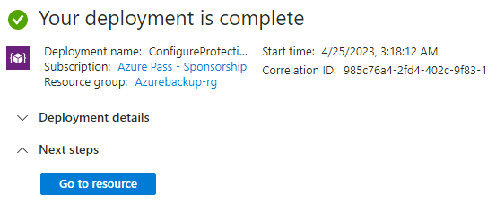

> **After enabling backup:**

- The Backup service installs the backup extension whether or not the VM
  is running.

- An initial backup will run in accordance with your backup schedule.

- When backups run, note that:

  - A VM that's running has the greatest chance for capturing an
    application-consistent recovery point.

  - However, even if the VM is turned off, it's backed up. Such a VM is
    known as an offline VM. In this case, the recovery point will be
    crash-consistent.

- Explicit outbound connectivity isn't required to allow backup of Azure
  VMs.

You have completed this task, please proceed ahead with the next task

> **Create a custom policy (Optional)**

If you selected to create a new backup policy, fill in the policy
settings.

1.  In **Policy name**, specify a meaningful name.

2.  In **Backup schedule**, specify when backups should be taken. You
    can take daily or weekly backups for Azure VMs.

3.  In **Instant Restore**, specify how long you want to retain
    snapshots locally for instant restore.

    - When you restore, backed up VM disks are copied from storage,
      across the network to the recovery storage location. With instant
      restore, you can leverage locally stored snapshots taken during a
      backup job, without waiting for backup data to be transferred to
      the vault.

    - You can retain snapshots for instant restore for between one to
      five days. The default value is two days.

    > **Note** Azure Backup doesn't support automatic clock adjustment for
    daylight-saving changes for Azure VM backups. As time changes occur,
    modify backup policies manually as required.

### Task 5 : Start a backup job

The initial backup will run in accordance with the schedule, but you can
run it immediately as follows:

1.  Go to **Backup center** and select the **Backup Instances** menu
    item.

    

2.  Select **Azure Virtual machines** as the **Datasource type**. Then
    search for the VM that you have configured for backup.

3.  Right-click **smarthotelweb1** or **smarthotelweb1** and then click
    on the ellipsis (…), and then select **Backup Now**.

    

4.  In **Backup Now**, use the calendar control to select the last day
    that the recovery point should be retained. Set the date 30 Days
    from the present day, then select **OK**.

    

5.  Monitor the portal notifications. To monitor the job progress, go
    to **Backup center** \ **Backup Jobs** and filter the list for **In
    progress** jobs. Depending on the size of your VM, creating the
    initial backup may take a while.

    

You have completed this task, please proceed ahead with the next task

### Task 6 : Monitor the backup job

The Backup job details for each VM backup consist of two phases,
the **Snapshot** phase followed by the **Transfer data to vault** phase.

1.  The snapshot phase guarantees the availability of a recovery point
    stored along with the disks for **Instant Restores** and are
    available for a maximum of five days depending on the snapshot
    retention configured by the user. Transfer data to vault creates a
    recovery point in the vault for long-term retention. **Transfer
    data** to vault only starts after the snapshot phase is completed.

    

2.  There are two **Sub Tasks** running at the backend, one for
    front-end backup job that can be checked from the **Backup
    Job** details pane.

    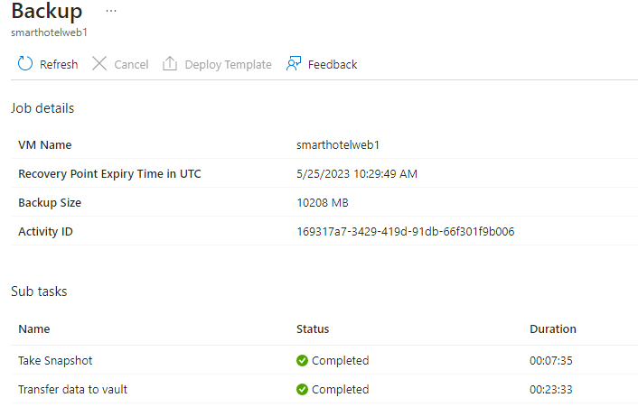

You have completed this task, please proceed ahead with the next task

### Task 7 : Clean up deployment

When no longer needed, you can disable protection on the VM, remove the
restore points and Recovery Services vault, then delete the resource
group and associated VM resources

If you're going to continue on to a Backup tutorial that explains how to
restore data for your VM, skip the steps in this section and go to Next
steps.

1.  Select the Resource group **Azurebackup-rg** and then
    select **Recovery Service** **Vault**.

    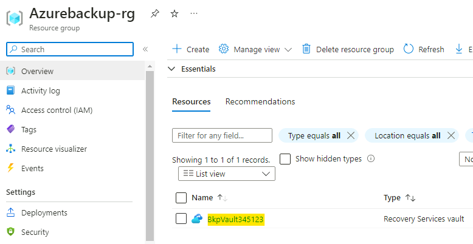

2.  Select **Backup items** from left navigation and then select **Azure
    virtual** **machine**.

    

3.  From the list of the Virtual Machines, click on the ellipsis
    of **smarthotelweb1** and select **Stop backup.**

    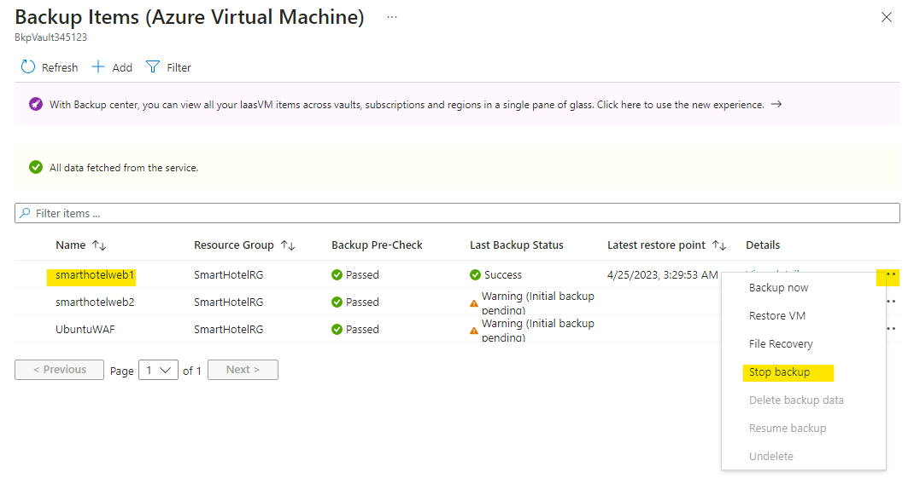

4.  On the **Stop backup** page, provide the below details

    - Stop backup level – **Delete backup data**

    - Type the name of the backup item – `smarthotelweb1`

    - Reason – **Other**

    - Comment – `Testing completed`

    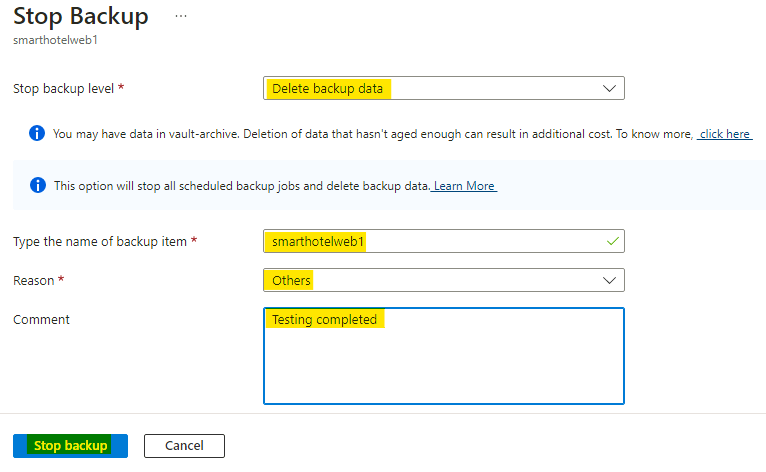

5.  Click on **Stop backup** button.

    

6.  Repeat the same steps for the below VMs

    - **Smarthotelweb2**

    - **UbuntuWAF**

7.  **Refresh** and the status should now appear as shown in the below
    image

    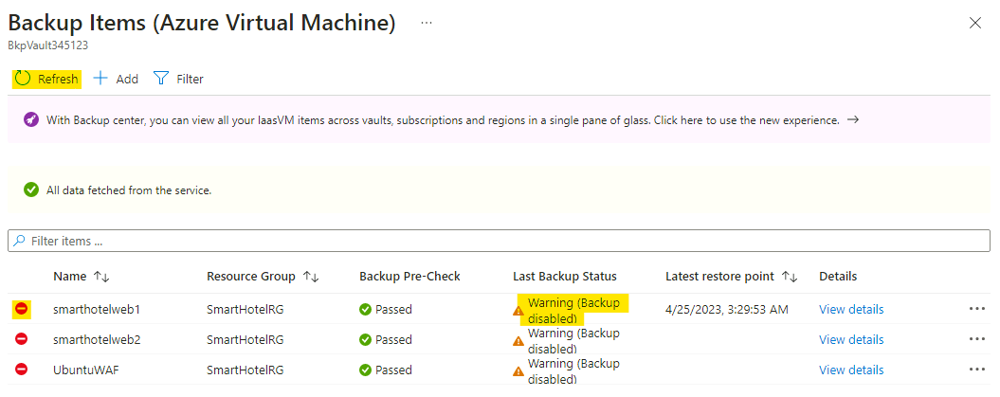

8.  While still on the Recovery Service Vault page, click
    on **Properties** under Setting, select the **Update** link
    under **Soft delete and security settings**.

    

9.  Uncheck the check boxes for **Soft delete** and then click on
    the **Update** button.

    

10. You should get the notification as shown in below image.

    

11. Select **Backup items** from left navigation and then select Azure
    virtual machine.

    

12. From the list of the Virtual Machines, click on the ellipsis of
    smarthotelweb1 and select **Undelete.**

13. Then right-click again on smarthotelweb1, and select **Delete backup
    data**

    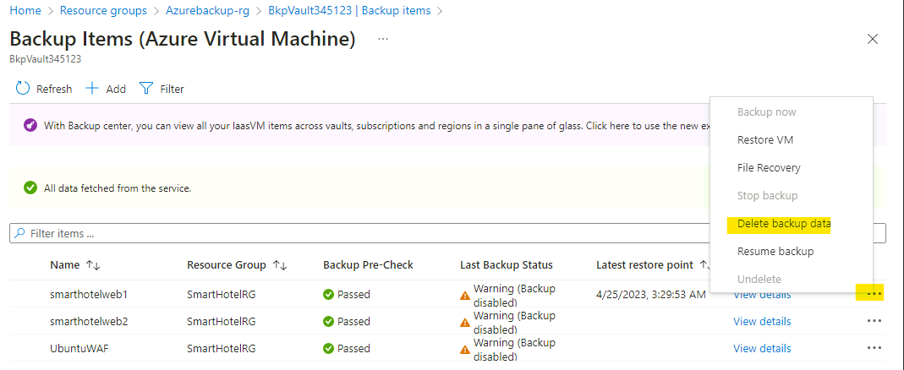

14. On the **Delete backup** page, provide the below details

    - Type the name of the backup item – `smarthotelweb1`

    - Reason – **Other**

    - Comment – `Testing completed`

15. Click on the **Delete** button

    

16. You should get the notification as shown in below image, and you
    will also notice that the backup has been successfully deleted too

    

17. Repeat the same steps for the below VMs

    - **Smarthotelweb2**

    - **UbuntuWAF**

18. From the Azure Portal menu or home page, select **Resource groups**.

    

19. From the list, choose your resource group. If you used the sample VM
    quickstart commands, the resource group is named **Azurebackup-rg**.

20. Select **Delete resource group**.

    

21. To confirm, enter the resource group name, then select **Delete**.

    

22. Once the Resource group is deleted it will give confirmation
    notification as shown in the below image.

    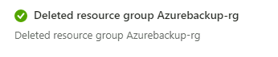

23. Click on Resource groups and select the **SmartHotelRG** Resource
    group and select the Application gateway – **SmartHotel-WAF** and
    then delete it, to ensure that we have sufficient credits to
    complete Activity 5.

    

## Exercise 4: Enable Microsoft Defender for Cloud

This exercise is to enable the Microsoft Defender for Cloud, once you
have successfully enabled it on your subscription, it will take *24
hours* for the Subscription data, recommendations, and other Defender
for Cloud features *to be fully visible*. We will be using the
information that the Microsoft Defender for Cloud collects through-out
these labs in the last Lab.

1.  On the Azure Portal click on portal menu and select `Microsoft
    Defender for Cloud`.

    

2.  Click on **Getting started** page from the left pane, On
    the Upgrade Tab, select subscription (**Azure Pass – Sponsorship**)
    and press **Upgrade**.

    

    > **Note:** You may need to wait for a few minutes for the upgrade to
    complete.

3.  You should get the notification as shown in below image.

    

4.  Click on the **Getting started**, then click on **Install
    agents** tab, then select the Azure Subscription and click **Install
    agents** to install agents to the resources in the subscription.

    

5.  You should get the notification as shown in below image.

    

6.  Click on the Portal Menu and select **+ Create a resource.**

    

7.  In the search box type log analytics and then click on **Log
    Analytics Workspace**.

    

8.  Click on the Create button.

    

9.  On the Create Log Analytics workspace page, on the **Basics** tab,
    provide the below details.

    - Subscription – **Azure Pass - Sponsorship**

    - Resource group – click on Create new - `RG4LAW`

    - Name – `LAW4mdfc

    - Region – **West US**

    - Click on **Review + Create**

    

10. After the Validation is passed, click on **Create**.

    

11. Wait for the deployment to complete.

    

12. Click on portal menu and select **Microsoft Defender for Cloud**.

    

13. Click on **Getting started** page from the left pane, On
    the **Upgrade** tab, select all listed Workspaces and
    press **Upgrade**.

    

14. You should get the notifications as shown in the below image.

    

15. Click on **Environment settings** under Management then
    Subscription – **Azure Pass - Sponsorship**

    

16. Click on **Settings & monitoring**.

    

17. On the **Settings & monitoring** page, click **On** for
    Vulnerability assessment for machines.

18. Click on the **Fix** link for Log Analytics agent/Azure Monitor
    agent.

    

19. When prompted click on the **Enable** button.

    

20. Click on **Continue** button.

    

21. Click on the **Save** button.

    

22. You should get the notification as shown in below image.

    

    > **Note:** This Task was to enable the Microsoft Defender for Cloud, it
    will take *24 hours* for the Subscription data, recommendations, and
    other Defender for Cloud features *to be fully.*

### Task 1 – Stop the VMs to save credits

1.  While still in the Azure Portal click on Portal Menu then select
    Virtual Machines or open the link
    - `https://portal.azure.com/#view/HubsExtension/BrowseResource/resourceType/Microsoft.Compute%2FVirtualMachines`

2.  Select all the listed VMs and then click on the ellipsis **…** and
    then click on **Stop** button.

    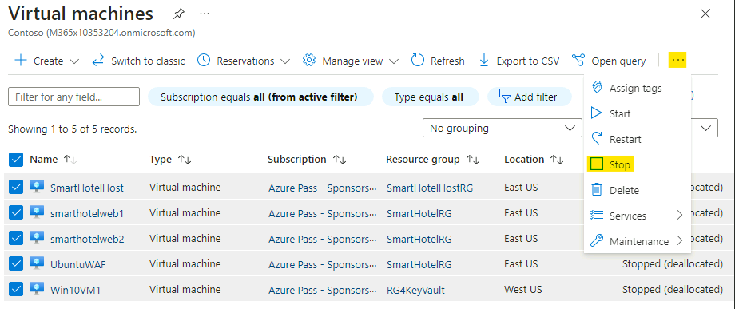

3.  Click on **Yes** to confirm

    

4.  You should get the notification as shown below.

    

5.  Verify that all the VMs are showing the status as **Stopped
    (deallocated)**

    

**Summary**

We should successfully have setup up the post-migration optimization.

We should have successfully deployed the VMs using the key vault for
storing password used during deployment.

We should have successfully used the Recovery Service Vault to store the
backup for the migrated VMs.

Lastly, we will enable Microsoft Defender for Cloud and do the necessary
configuration.

