# Lab 09 – Integrating Microsoft Sentinel and Microsoft Defender for Cloud

## Objective

We had enabled the Microsoft Defender for Cloud the previous lab. In
this Lab we will deploy the Microsoft Sentinel, and we will also explore
various Dashboards for Microsoft Defender for Cloud.

We will then integrate the Microsoft Defender for Cloud with Microsoft
Sentinel to generate sample Incidents on our workloads.

## Exercise 1 – Deploying Microsoft Sentinel and integrating with Microsoft Defender for Cloud

### Task 0 – Starting the VMs used for testing

1.  While still in the Azure Portal click on Portal Menu then select
    Virtual Machines or open the link
    - `https://portal.azure.com/#view/HubsExtension/BrowseResource/resourceType/Microsoft.Compute%2FVirtualMachines`

2.  Select **smarthhotelweb1**, **smarthotelweb2** and **Win10VM1** VMs
    and then click on the ellipsis **…** and then click
    on **Start** button.

    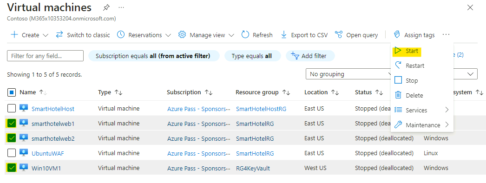

3.  Click on **Yes** to confirm.

    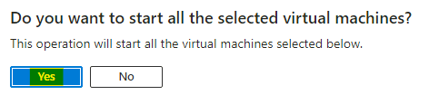

4.  You should get the notification as shown below.

    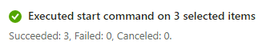

5.  Verify that the 3 VMs are showing the status as **Running**

    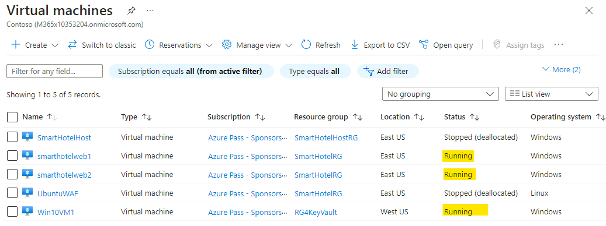

### Task 1: The Microsoft Sentinel workspace

In this exercise we will associate a Log analytics workspace to
Microsoft Sentinel. This workspace was created in the previous lab where
Microsoft Defender for Cloud was enabled.

1.  In the browser tab navigate
    to `https://portal.azure.com/#view/Microsoft_AAD_UsersAndTenants/UserManagementMenuBlade/~/AllUsers` and
    select the **Tenant Administrator** account

    

2.  Select the **Assigned roles** under Manage and then click on **+ Add
    assignments**.

    

3.  Search and select **Security Administrator**, then click on
    the **Add** button.

    

    

4.  Navigate to the `http://portal.azure.com` and log Office 365
    Tenant credentials provided on the **Home/Resources tab** of your
    lab environment.

5.  In the top search bar, type `Microsoft Sentine`l and click
    on **Microsoft Sentinel**.

    

6.  In the **Microsoft Sentinel** screen, click **Create** at the top
    left.

    

    > **Note** - You can choose to add **Microsoft Sentinel** to an
    existing **Log Analytics** **workspace** or build a new one. We are
    using the same workspace for both Microsoft Sentinel and Microsoft
    Defender for Cloud, so that all logs collected by Microsoft Defender for
    Cloud can also be ingested and used by Microsoft Sentinel.

7.  Select your workspace named **LAW4mdfc** and click **Add** at the
    bottom.

    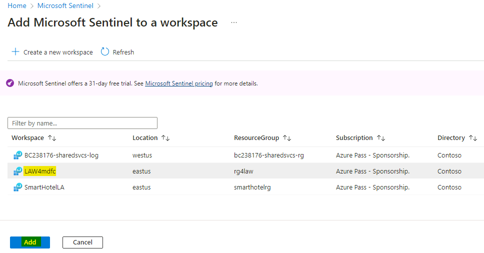

8.  You should get the notifications as shown in below images

    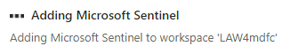

    

9.  Once in the Microsoft Sentinel interface, click **OK** on the trial
    activation message.

    

10. Click on the What’s new tab and review the recent update to
    Microsoft Sentinel

    

Your Microsoft Sentinel workspace is now ready to use!

### Task 2: Enable Microsoft Defender for Cloud data connector

In this task we will enable the Microsoft Defender for Cloud data
connector. This connector allows you to stream your security alerts from
Microsoft Defender for Cloud into Microsoft Sentinel, so you can view
Defender data in workbooks, query it to produce alerts, and investigate
and respond to incidents.

1.  While still in the Microsoft Sentinel interface, click on **Data
    Connectors** under Configuration section.

2.  You should get the message **“Data Connector with "content source =
    gallery content" have been removed.** In that message select
    the **Click here** link.

    

3.  On the **Out-of-the-box Content Centralization** page click
    on **Continue**.

    

4.  Click on the Complete centralization button.

    

5.  You should receive the notification as shown in below image.

    

6.  From the top click on the link for **Microsoft Sentinel** or
    navigate back to the Sentinel page.

    

7.  Click on the Refresh button and you should be able to see the Data
    connectors showing.

    

8.  Click on **Content hub**.

    

9.  On the Content hub page search for `microsoft defender for
    cloud` and then select **Microsoft Defender for Cloud** content
    and click on **Install** button.

    

    

10. While still on the **Microsoft Sentinel** page click on **Data
    Connectors** under **Configuration** section.

    

11. In the **Data connectors** screen, type tenant in the search bar,
    select the `Tenant-based Microsoft Defender for Cloud
    (Preview)` connector and click on **Open connector page**.

    

12. On the **Tenant-based Microsoft Defender for Cloud
    (Preview)** connector page, under **Configuration** section click on
    the **Connect** button.

    

13. You should receive the notification as Connected successfully.

    

14. Wait for 1-2 minutes and then refresh the page, the Status of the
    connector should also be updated to **Connected**.

    

15. Click on **Incidents** under Threat management, you should see the
    message as **No incidents were found**.

    

## Exercise 2 – Exploring Microsoft Defender for Cloud Dashboards

Microsoft Defender for Cloud provides interactive dashboards that
provides a unified view into the security posture of your hybrid cloud
workloads. Additionally, it shows security alerts, coverage information,
and more.

You can select any element on the page to get more detailed information.

1.  Open the Edge browser and navigate to the Azure
    Portal `https://portal.azure.com` if prompted for login use the
    Office 365 Tenant credentials from the **Home/Resources tab**.

2.  Click on the **Portal Menu** and then select **Microsoft Defender
    for Cloud**

    

3.  It will open the **Overview** page, which will feature as an
    interactive dashboard showing various workloads like

    1.  **Security posture**

    2.  **Regulatory compliance**

    3.  **Workload protections**

    4.  **Inventory**

    

4.  Click on the **Inventory** Dashboard

    

5.  It will open the **Inventory** page

    

6.  You should be able to see that the Monitoring agent is
    showing **Installed** on the Smart Hotel VMs. Click on
    the **smarthotelweb1**.

    

7.  On the Resource health page, you should be able to see
    the **Description** about the Recommendations and the **Status** of
    the same.

    

8.  Close the Balde for **smarthotelweb1** and then you can optionally
    review the other VMs and workloads and their recommendations.

9.  Back on the Microsoft Defender for Cloud page, click
    on **Recommendations** to see a list of recommendations across the
    various resources within the Subscription.

    

10. We can expand the title recommendation to see sub recommendations
    and then click on any recommendation and accordingly apply the Fix
    which is suggested.

    

11. Click on **Security alerts**

    

12. We can see the Alerts for the Resource which have been onboarded. We
    can also generate sample alerts which we will do in the later
    exercises.

13. From the Microsoft Cloud for Defender page, go to **Security
    posture** under **Cloud Security**.

14. Note that details about the resource count marked as **Unhealthy
    resources**.

    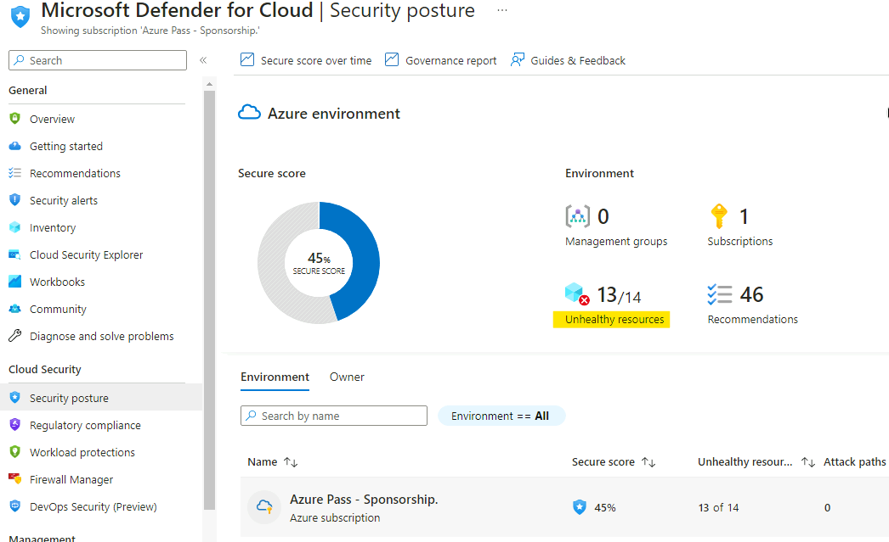

15. Click on **View recommendations**.

    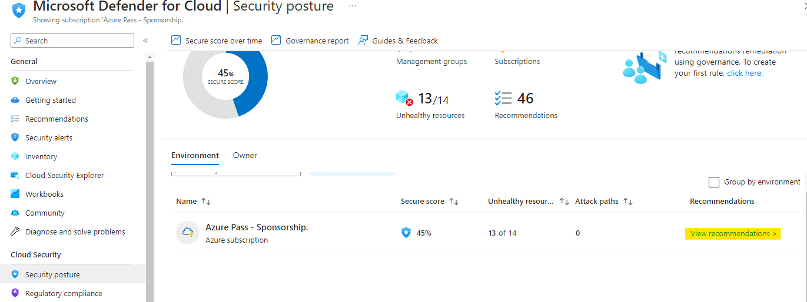

16. We will review the **Recommendations** to make our environment more
    secure and to increase the security score.

    

17. Expand **Secure management ports**, and select **Management ports
    should be closed on your virtual machines**.

    

18. Expand the **Remediation steps** and review it

    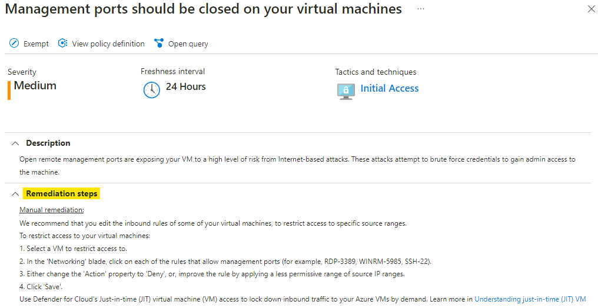

19. Make a note of the listed 2 unhealthy resources, we will enable JIT
    access on the **Win10vm1** and revisit this recommendation.

    

20. Switch back to the **Overview** page of the Microsoft Defender for
    Cloud and click on **Regulatory Compliance**

21. The regulatory compliance dashboard provides insights into your
    compliance posture based on how you're meeting specific compliance
    requirements.

    

22. Close the Regulatory compliance blade and switch back to
    the **Overview** page.

23. Click on the **Workload Protection**, the Workload Protection
    provides,

    - Visibility into your Microsoft Defender for Cloud coverage across
      your different resource types.

    - Links to configure advanced threat protection capabilities.

    - The onboarding state and agent installation.

    - Threat detection alerts.

    

24. Scroll down to check the **Advance protection**, in this section,
    you can see the status of the resources in your selected
    subscriptions for each of these protections.

    

## Exercise 3 – Enabling Just-in-time (JIT) VM access.

We can use Microsoft Defender for Cloud's just-in-time (JIT) access to
protect your Azure virtual machines (VMs) from unauthorized network
access. Many times firewalls contain allow rules that leave your VMs
vulnerable to attack. JIT lets you allow access to your VMs only when
the access is needed, on the ports needed, and for the period of time
needed.

1.  Click on the Portal Menu and select **Microsoft Defender for
    Cloud** then click on **Workload Protection** under Cloud Security.

    

2.  Scroll down and click on the link for **Just-in-time
    VM** **access** under Advanced protection.

    

3.  On the Just-in-time VM access page, select the **Win10VM1** and then
    click on the **Enable JIT on 1 VM** button.

    

4.  On the JIT VM access configuration page, click on
    the **Save** button

    

5.  You should receive the notifications as shown in below image

    

6.  Click on the **Configured** tab to see the **Win10VM1** is now
    listed there

    

7.  Click on the ellipsis … and select **Properties**, it will open the
    Overview page of the Win10VM1

    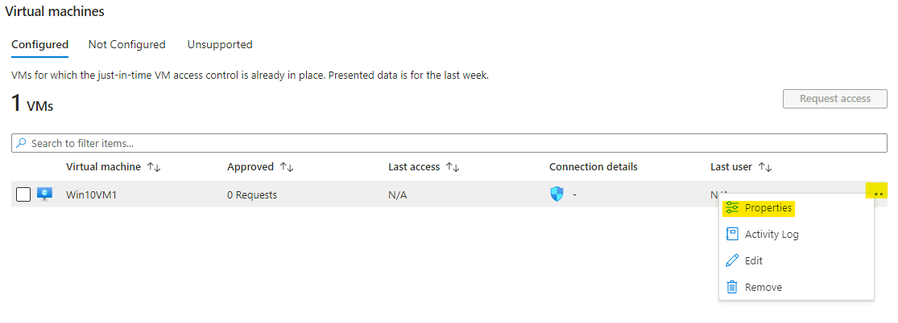

8.  Click on **Connect**

    

9.  You will notice new feature **Request access** button, click on it.

    

    

10. You will receive notifications as shown in below images.

    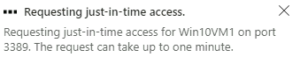

    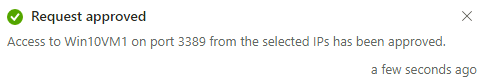

11. Now the **Download RDP file** button becomes available, click on it

    

12. When prompted click on the **Keep** button

    

13. Connecting using the downloaded RDP file and use the below
    credentials to login

    - Username – `demouser`

    - Password – `demo!pass123`

    

14. You should be able to connect successfully.

    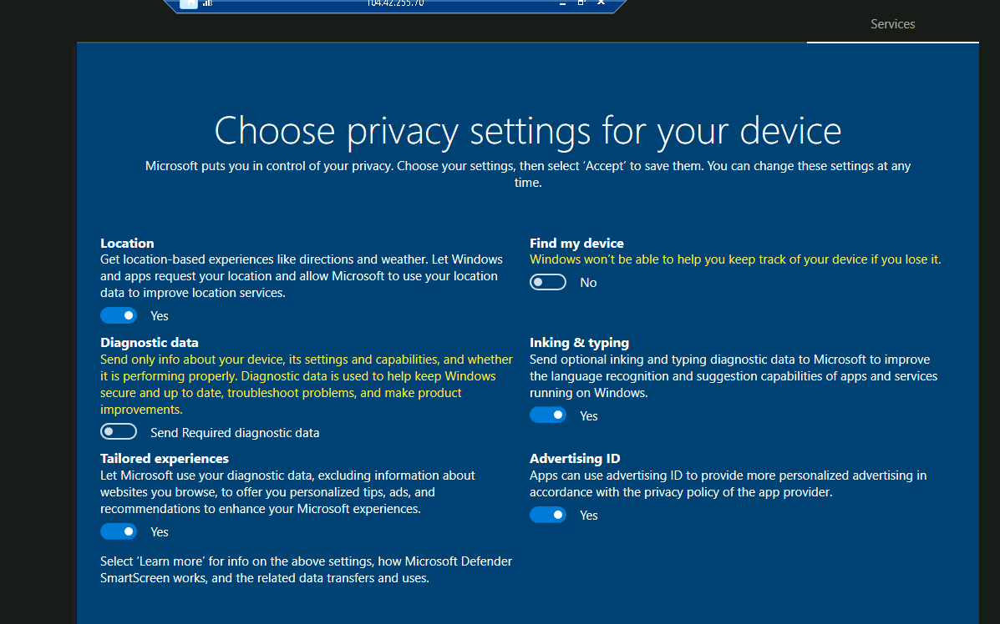

15. Hence we have successfully enabled and tested the JIT VM access on
    the VM – **Win10VM1**

## Exercise 4 – Configuring Microsoft Defender for Servers.

1.  In the Azure Portal click on the Portal menu and select **Microsoft
    Defender for Cloud**.

2.  Click on **Environment settings**, then select the Subscription
    – **Azure Pass – Sponsorship**

    

3.  It will open the **Defender plans**, click on **Settings** link
    under Servers.

    

4.  Click on **Edit configuration** link under **Log Analytics
    Agent/Azure Monitor agent**

    

5.  On the **Auto-provisioning configuration** tab, ensure that **Log
    Analytics Agent (Default)** is selected, select Custom workspace and
    choose **LAW4mdfc** and in the Security event storage, choose **All
    Events** from the drop-down and then click on **Apply.**

    

6.  Click on **Continue** button

    

7.  Click on **Save**

    

8.  You should get notification as shown in below image.

    

9.  Back on the Defender plans page click on the link **Change plan
    \** under Servers section.

    

10. Review the details of the Microsoft Defender for Servers Plans
    available and then click on the **Cancel** button.

    

## Exercise 5 – Managing Alerts in Microsoft Defender for Cloud

### Task 1 – Generate Alerts from Smarthotelweb2

1.  Click on the Portal Menu and select Virtual Machines or click on the
    link
    - `https://portal.azure.com/#view/HubsExtension/BrowseResource/resourceType/Microsoft.Compute%2FVirtualMachines`

2.  Select the **smarthotelweb2** VM, then from the overview blade,
    select **Connect**.

    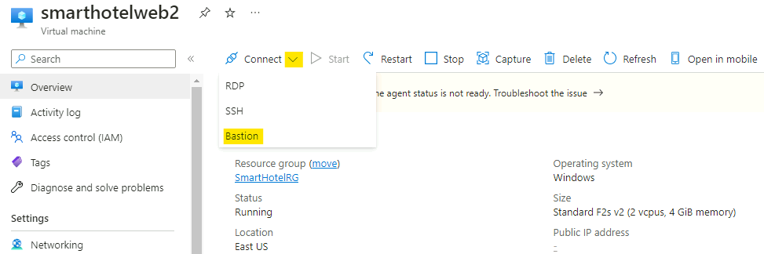

3.  Select **Bastion** and connect to the machine with the
    Username **administrator** and the password **demo!pass123**

    

    > **Note** - A popup blocker of your web browser must be disabled in order
    to connect, and when prompted, **Allow** clipboard access.

    

    

4.  Once logged into the VM, open file explorer open the folder
    - `C:\Windows\system32`

5.  Search for the file `calc`, right-click on it and
    select **Copy** and then paste it on the desktop.

    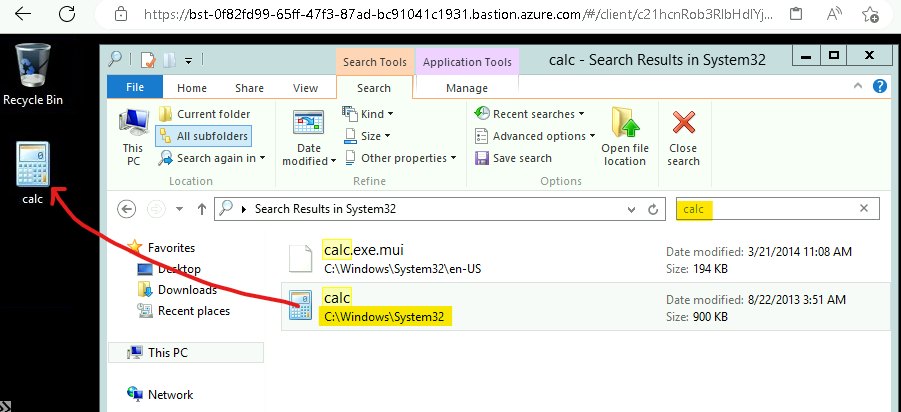

6.  Rename the file as `ASC_AlertTest_662jfi039N.exe`

7.  Once it has been renamed then launch the **PowerShell** from the
    Start menu and run the below commands

    `cd .\Desktop\`

    `.\ASC_AlertTest_662jfi039N.exe -foo`

    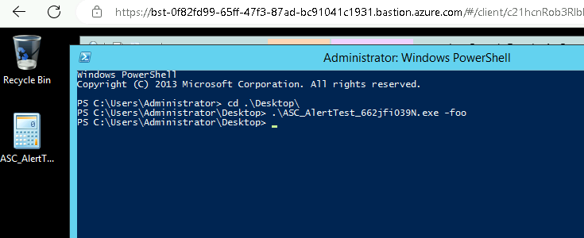

8.  Switch back to the Edge browser tab with the Azure Portal open on
    the lab VM, click on the **Portal Menu** and select **Microsoft
    Defender for Cloud**

    

9.  Click on **Security alerts**, you should be able to see 1 alert.

    

10. Click on the alert, then click on **View full details** button.

    

11. On the **Full details** page review the details

    - Compromised Host

    - Suspicious Command Line

    - User Name

    - Parent Process

    - Suspicious Process

    

12. Expand the **Related entities** and review the information, then
    click on **Next: Take Action \\**.

    

13. Review the available actions, then expand **Configure email
    notification settings** and then click on **Configure settings**

    

14. On the **Email notifications** page set the All users with the
    following roles to **Owner**, provide the email of the Tenant admin
    in the Additional email section and then notification severity
    to **High** then click on **Save** button

    

15. You should get the notification as shown in below image

    

16. Close the **Email Notification** page, then close the **Full
    details** page.

### Task 2 – Generating Sample alerts for Microsoft Defender for Cloud

1.  Switch back to the Edge browser tab with the **Security
    alerts** page open, then close the full details page.

2.  You should be back on the **Microsoft Defender for Cloud** page.

3.  Ensure that you have clicked on the **Security
    alerts** under **General**, then click on **Sample alerts** button

    

4.  On the **Create sample alerts (Preview)** tab, provide the below
    details

    - Subscriptions – **Azure Pass – Sponsorship**

    - Defender for Cloud plans – choose

      - **Containers**

      - **Azure SQL Database**

      - **Virtual Machines**

      - **SQL Servers on machines**

    - Click on **Create sample alerts**

    

5.  You should get the notification as shown in below image

    

6.  Click on the **Refresh** button and the number of alerts should now
    be increased.

    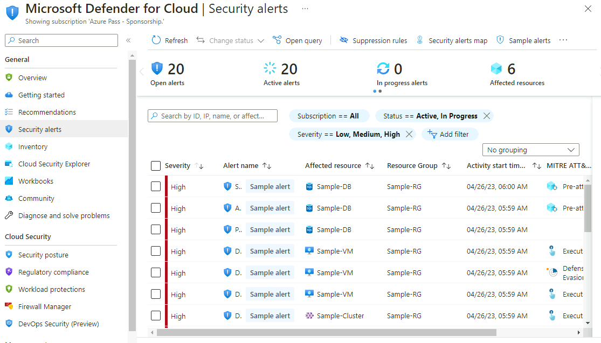

7.  We have successfully generated Sample alerts in the **Microsoft
    Defender for Cloud**.

8.  You can additionally create more sample alerts.

    

9.  Refresh to see the additional sample alerts.

    

## Exercise 6 – Review Incidents in the Microsoft Sentinel

### Task 1 – Review Alerts in Microsoft Sentinel

1.  In the Azure Portal search for `sentinel`, then click
    on **Microsoft Sentinel**.

    

2.  Click on the **Sentinel workspace** named **LAW4mfdc**.

    

3.  It will open the Overview of the Microsoft Sentinel, review the
    Dashboards on the Overview page.

    - **Incidents**

    - **Automation**

    - **Data**

    - **Analytics**

    

    

4.  Turn off the **New overview** switch, to get the old view of the
    Overview page

    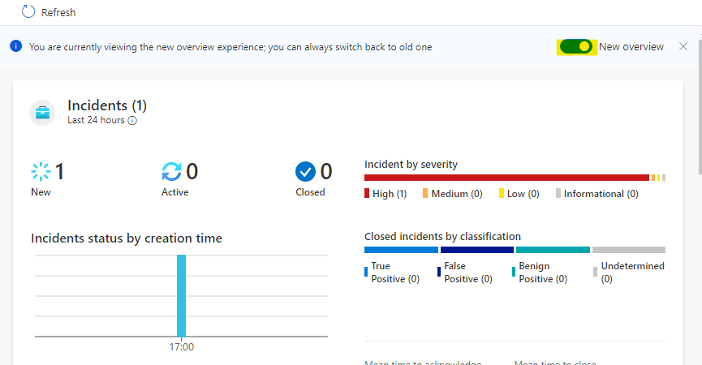

5.  In the old view of the **Overview** page, we can see that we have
    the Incident/alerts listed under **Events / Events and alerts over
    time section** which we had seen in the Microsoft Defender for Cloud

    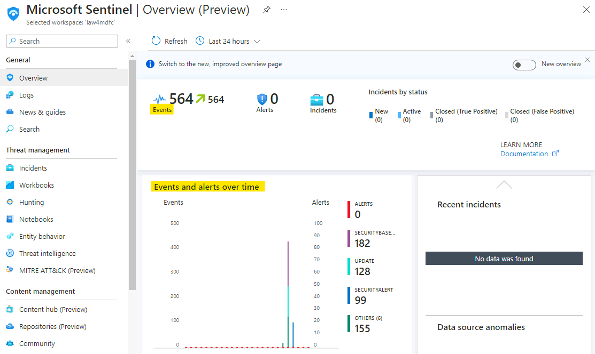

6.  Click on **SecutityBaseLine**

    

7.  It will open a Log Analytics Query page, which will list all the
    Events in details, scroll towards the right to see the details, we
    should be able to see the events are from **smarthotelweb1** which
    were generated in **Exercise 5 – Task 1**

    

8.  Close the query windows to come back to the overview page, now click
    on the **Update**.

    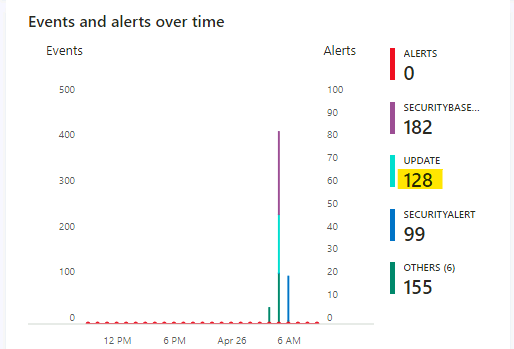

9.  It will open a Log Analytics Query page, which will list all the
    Events in details for the Windows Updates required on the
    smarthotelhostweb1, here it should listed other VMs if there are in
    a running state.

    

10. Close the Log analytics query for Updates and then click
    on **SecurityAlerts**

    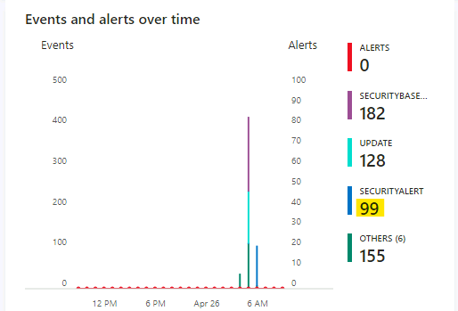

11. It will open a Log Analytics Query page, which will list all the
    Events in details which got generated as a part of **Sample
    Alerts** generated in **Exercise 5 – Task 2**. You can review the
    details and alert types and al

    

12. Additionally, you can also modify the KQL query to be as below and
    then click on **Run** button

    `union (SecurityAlert
        | where ProviderName != 'ASI Scheduled Alerts' and ProviderName != 'CustomAlertRule')| make-series Requests = count() default = 0 on TimeGenerated from ago(1d) to now() step 1h by RequestName = AlertSeverity`

13. The above query will organize the response
    to **AlertSeverity** count.

    

14. Click on the **Chart** tab under the Results section

    

15. Close the Log analytics query for **SecurityAlerts** and then click
    on **Others**

    

16. Review the listed Alerts.

    

17. Close the Log analytics query for Others.

### Task 2 – Create Sample Incidents

1.  While still in the Microsoft Sentinel interface, click
    on **Incidents** under **Threat Management**. Click on **+ Create
    incident (Preview)**

    

2.  On the **+ Create incident (Preview)** tab, provide the below
    details.

    - Title – `Sample Incident 1`

    - Description - `Sample Incident 1`

    - Severity – **High**

    - Status – **New**

    - Owner – leave it blank

    - Click on **Create**

    

3.  We will create one more incident with below details

    - Title – `Sample Incident 2`

    - Description - `Sample Incident 2`

    - Severity – **Medium**

    - Status – **Active**

    - Owner – **Assign to me**

    - Click on **Create**

    

4.  Click on the **Incidents** again and notice that the Incidents count
    has changed to **2**, even the **Active Incidents** is updated.

    

5.  Click on the Incident with **High Severity – Sample Incident
    1** under Recent incidents

    

6.  Click on **Actions** and then select **Create automation rule**.

    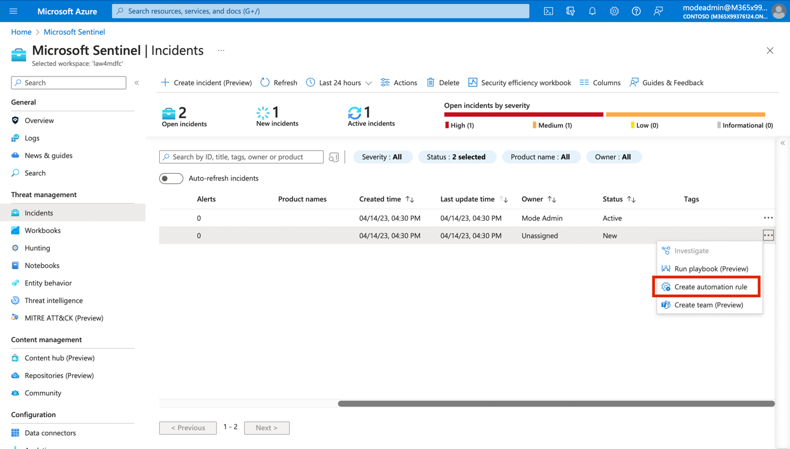

7.  On the Create new automation rule provide the below details

    - Automation rule name – `Automation Rule 1`

    - Trigger – **When incident is created**

    - Condition – If Analytic rule name - **Contains** - **All**

    - Click on **+ Add**

    - **AND** – **Title** – **Contains** – type `Sample`

    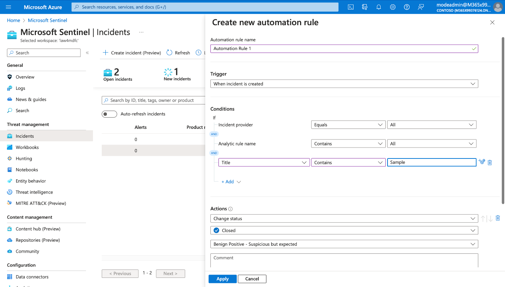

- Actions – **Assign owner - Assign to me**

- **+ Add action**

- And then – **Change status** – **Active -**

- **+ Add action**

- And then

- Add tags – `SampleIncident`

- Rule expiration - set the date 1 month from today

- Click on **Apply** button

    

8.  You should get the notification as shown in below image

    

9.  Close the Incident page.

10. Click on **Incidents** and then click on **+ Create incident
    (Preview)**

    

11. On the **+ Create incident (Preview)** tab, provide the below
    details

    - Title – `Sample Incident 3`

    - Description - `Sample Incident 3`

    - Severity – **Low**

    - Status – **New**

    - Owner – leave it blank

    - Click on **Create**

    

12. Click on the **Refresh** button, then click on the new
    Incident **Sample Incident 3**

    

13. If the Automation rule had worked, we should see the change in
    the **Incident**, click on **View full details**.

    

14. We can see the that the Automation rule has applied an **Owner**,
    changed the Status and also added a Tag to this incident.

15. Similarly, we can create more automation rule to even close false
    positive Incident when we are aware and testing.

16. Close the **Incident page**.

## Exercise 7: Creating a custom Playbook.

### Task 1: Creating a Playbook

In this exercise, we will create a Playbook that will be later used in
the lab.

1.  While still in the **Microsoft Sentinel** interface click
    on **Settings** under Configuration, then click on
    the **Settings** tab

    

2.  Scroll down and under **Playbook permissions**, select **Configure
    permissions**.

    

3.  Select **all the resource groups** and select **Apply**.

    

4.  You will see a notification as shown in below image.

    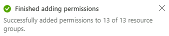

5.  From the **Microsoft Sentinel** navigation menu,
    select **Automation**.

    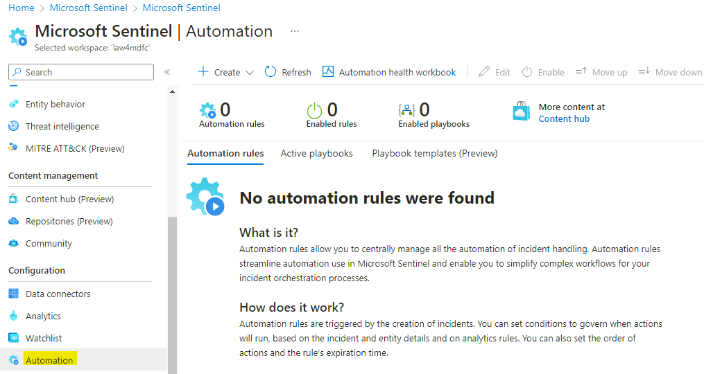

6.  Click on **+ Create** and then from the drop-down select **Playbook
    with incident trigger.**

    

7.  On the Create playbook page, provide the following details and click
    on **Next: Connections**.

    - Subscription – **Azure Pass - Sponsorship**

    - Resource group – **RG4LAW**

    - Playbook name – `customplaybook`

    - Select the checkbox for **Enable diagnostics logs in log analytics**.

    

8.  Click on **Next: Review and create**.

    

9.  Then select **Create and continue to designer**.

    

    

10. Click on **+** under the **Microsoft Sentinel Incident**

    

11. Click on **Add an action**

    

12. Search for `Add comment to incident` and select **Add comment to
    incident (V3) (Preview). **

     

13. In the Incident ARM ID,
    type `@triggerBody()?['object']?['id']`

14. In the comment section type - `This comment marks the successful
    run of our custom playbook`

15. Click **Save**. 

     

**Congratulations!** You successfully created a playbook that adds the
comment to any incidents. You can modify the steps according to your
need in the flow designer to create custom automation flow.

### Summary

You should have successfully deployed the Microsoft Sentinel using the
workspace **LAW4mdfc**

You should have explored various Dashboards for Microsoft Defender for
Cloud.

You should have successfully integrated the Microsoft Defender for Cloud
with Microsoft Sentinel to generate sample Incidents on our workloads
and should have been able to see the Alerts and Event in both the
consoles.

**Microsoft Defender for Cloud**

**Microsoft Sentinel - Events**

